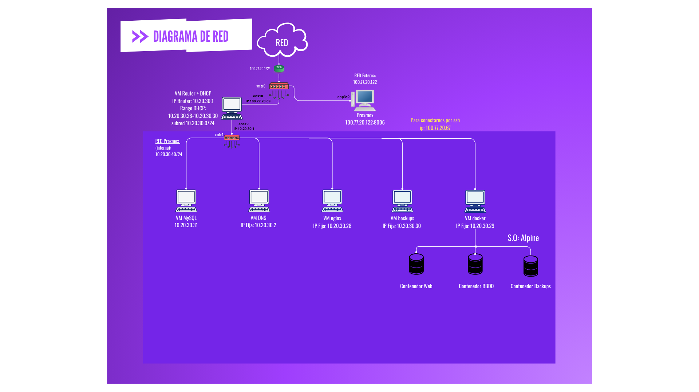
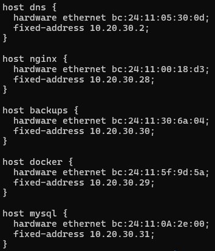

<h1>HELP AUT</h1>

<h3>Trabajo realizado por:</h3>
<h4>Albert, David y Mariona</h4>

<details>
    
<summary><h3>Parte 1</h3></summary>

<br>

<details>
<summary><h2>💡 Explicación de la idea del proyecto</h2></summary>
    <p>
        Nuestra plataforma responde a una necesidad urgente: facilitar el acceso a profesionales de la psicología para niños autistas y adultos con esta condición. Reconocemos que encontrar un terapeuta adecuado, que se ajuste a las necesidades individuales y establezca una relación de confianza, es un reto para muchas familias.

La aplicación web permitirá a los usuarios buscar psicólogos a través de un portal intuitivo. Utilizando un sistema de filtrado, los usuarios podrán encontrar profesionales cercanos y especializados. Una vez seleccionado, podrán comunicarse a través de un buzón de mensajes y, si lo desean, optar por un plan premium que incluye videollamadas y chat en tiempo real, ofreciendo una interacción más directa.

Además, la plataforma contará con una agenda para gestionar citas y videotutoriales educativos que ayudarán a los padres a comprender mejor el autismo y a equiparse con herramientas útiles. Nuestro objetivo es hacer que la terapia sea más accesible y económica, superando las barreras de espera del sistema público y los altos costos de las consultas privadas.

Buscamos crear un recurso integral que conecte a personas autistas con psicólogos adecuados, promoviendo una atención psicológica de calidad y contribuyendo al bienestar de la comunidad autista.
    </p>
</details>


<details>
<summary><h2>🎯 Objetivo que se persigue</h2></summary>
    <p>
       El objetivo principal de nuestra plataforma es facilitar el acceso a servicios de psicología para personas con autismo y sus familias, asegurando que puedan conectarse fácilmente con profesionales capacitados que les brinden el apoyo que necesitan. Nuestra propuesta surge de la dificultad que enfrentan muchas personas para encontrar un psicólogo adecuado, con quien puedan establecer un seguimiento continuo y una conexión de confianza.

Hoy en día, obtener una cita con un profesional puede ser un proceso largo y frustrante, especialmente en el sistema de salud pública, donde las esperas pueden extenderse por meses. Además, las tarifas de los psicólogos privados suelen ser demasiado altas para algunas personas, lo que limita el acceso a una atención de calidad. Por ello, hemos diseñado esta aplicación web con el propósito de ofrecer una alternativa asequible y efectiva.

Nuestra plataforma no solo permite a los usuarios buscar y filtrar profesionales según sus necesidades específicas, sino que también ofrece una serie de servicios que garantizan una experiencia integral. Los padres y cuidadores de niños autistas, así como adultos con la misma condición, podrán encontrar psicólogos adecuados en su área geográfica y comunicarse con ellos a través de un sistema de mensajería. A través de nuestra agenda, los usuarios podrán gestionar sus citas y, si lo desean, optar por un servicio de videollamadas que les permita realizar sus sesiones de terapia de manera interactiva y conveniente. Esto no solo favorece la flexibilidad en el acceso a la terapia, sino que también facilita la continuidad del tratamiento.

Además, la plataforma incluye recursos educativos como videotutoriales que ofrecen información sobre el autismo, ayudando a los padres a comprender mejor la condición de sus hijos y a desarrollar herramientas que mejoren su calidad de vida.

En resumen, nuestra intención es crear un espacio donde las personas autistas y sus familias puedan acceder a una atención psicológica de calidad de manera rápida, accesible y adaptada a sus necesidades, contribuyendo así a su bienestar y crecimiento personal.
    </p>
</details>

<details>
<summary><h2>🛠️ Servicios</h2></summary>
<p>
       Para asegurar que la plataforma cumpla con sus objetivos, hemos delineado una serie de servicios esenciales y adicionales que se implementarán en diferentes fases del desarrollo. Los servicios básicos incluirán:

<strong>Búsqueda de Profesionales:</strong> Los usuarios podrán filtrar y buscar psicólogos según su ubicación y especialización, lo que facilitará la conexión con aquellos que estén más cerca y que mejor se ajusten a sus necesidades.

<strong>Mailbox:</strong> Un buzon de correo por donde recibiran emails. Es otra forma de contactar paciente-psicologo.

<strong>Chat en Tiempo Real:</strong> Un servicio que permitirá una comunicación más fluida y constante entre los usuarios y los psicólogos, promoviendo un espacio de diálogo continuo. Es una herramienta esencial porque es de las que facilitará más el contacto, sobretodo inicial, entre el paciente y el psicologo.

<strong>Videollamadas:</strong> Este servicio proporciona una experiencia de terapia más interactiva y personalizada, facilitando sesiones en tiempo real entre los usuarios y los profesionales. Las videollamadas son gestionadas de manera segura y eficiente por la plataforma, lo que garantiza un entorno cómodo y accesible para los usuarios. Este recurso no es obligatorio, ya que los pacientes también tienen la opción de realizar terapia de manera presencial con su psicólogo. Sin embargo, para aquellos que prefieren la comodidad y flexibilidad que ofrecen las videollamadas, este servicio les permite mantener un contacto directo y continuo con su terapeuta, favoreciendo una conexión más profunda y efectiva en el proceso terapéutico.

<strong>Agenda:</strong> Una funcionalidad en la que los usuarios podrán gestionar sus citas y sesiones de terapia directamente en la plataforma, lo que les ayudará a llevar un seguimiento de su progreso y a organizar su agenda.

<strong>Videotutoriales:</strong> Estos recursos están diseñados para informar y educar a los usuarios sobre el autismo, proporcionando una comprensión más profunda de esta condición. Para los padres, los videotutoriales ofrecerán herramientas prácticas y estrategias que les ayudarán a apoyar a sus hijos en su desarrollo diario, mejorando así su calidad de vida. A través de contenido accesible y fácil de entender, buscamos empoderar a los usuarios y fomentar una comunidad más informada y solidaria.

Además, es importante destacar que la terapia ofrecida a través de nuestra plataforma es más asequible que la terapia convencional privada. Esto permite que más personas tengan acceso a servicios psicológicos de calidad, contribuyendo así a una atención más accesible y regular. Nuestro objetivo es garantizar que todos los usuarios, independientemente de su situación económica, puedan beneficiarse de la terapia y el apoyo que necesitan.
    </p>

<h3>Planes</h3>

<strong>Plan Básico:</strong> El Plan Básico está diseñado para ofrecer a los usuarios acceso a los servicios esenciales sin ningún costo. Este plan incluye:
<ul>
 <li>Mailbox </li>
 <li>Buscador de Psicólogos: Los usuarios solo pueden hacer "match" con un máximo de 5 psicólogos al mes. </li>
</ul>
</ul>

<strong>Plan Premium:</strong> El Plan Premium está diseñado para aquellos que buscan una experiencia más completa y personalizada. Este plan incluye todos los beneficios del Plan Básico, además de características avanzadas:
<ul>
 <li>Mailbox </li>
 <li>Matches Ilimitados con Psicólogos: A diferencia del plan básico, los usuarios del plan premium pueden hacer "match" con la cantidad que deseen,         
        permitiéndoles explorar diversas opciones y encontrar el profesional qureapartoe mejor se adapte a sus necesidades. </li>
 <li>Chat </li>
 <li>Videollamadas </li>
 <li>Agenda </li>
 <li>Videotutoriales </li>
</ul>
</details>

<details>
<summary><h2>👥 Organización y roles del equipo</h2></summary>
    <p>
    Todos estaremos involucrados en cada etapa de este proyecto, pero cada uno tendrá un área de especialización:
    </p>
    <ul>
        <li><strong>Albert</strong> - Front-end</li>
        <li><strong>Mariona</strong> - Back-end</li>
        <li><strong>David</strong> - Infraestructura</li>
    </ul>
    <p>
       Al finalizar cada tarea asignada, haremos una revisión conjunta de los avances y actualizaremos tanto <strong>Trello</strong> como nuestro repositorio en <strong>GitHub</strong>. para que nuestros profesores puedan ver y revisar la evolución del proyecto, además de sugerir cambios o mejoras para obtener un mejor resultado. Esto también se hará para resolver dudas que puedan surgir.
    </p>
</details>

<details>
<summary><h2>💻 Tecnologías a utilizar (lenguajes, frameworks, sistemas, software)</h2></summary>

- **Front-end:** Para el desarrollo del front-end de la página web, utilizaremos HTML como la estructura básica del proyecto, CSS para mejorar la apariencia visual y JavaScript para añadir interactividad y facilitar la conexión con el backend. También implementaremos Bootstrap para agilizar el desarrollo y asegurar que la página sea responsive y brinde una buena experiencia de usuario.
  
- **Back-end:** Para el back-end, utilizaremos PHP, que permitirá la conexión entre el front-end y la base de datos, de modo que los datos de los usuarios y otra información solicitada puedan guardarse correctamente. La base de datos se implementará en MySQL, ya que es el sistema que mejor conocemos. Para diseñar y gestionar la base de datos, emplearemos MySQL Workbench, que nos permite crear tanto los diagramas como el código SQL necesario.
  
- **Infraestructura:** La infraestructura se implementará utilizando Proxmox en un servidor físico ubicado en nuestro aula. En esta plataforma, configuraremos diversas máquinas virtuales en base al diagrama de red que hemos creado:
  - **Router:** Tendremos una máquina virtual que funcionará como router, estableciendo la conexión entre la red interna y la externa. Dentro de esta máquina virtual del router, configuraremos el servicio DHCP para asignar dinámicamente direcciones IP a las demás máquinas virtuales.
  - **Servidor DNS:** Crearemos una máquina virtual dedicada a los servicios DNS, que permitirá la resolución de nombres de dominio en la red interna, facilitando el acceso entre las diferentes máquinas y servicios dentro de la infraestructura.
  - **Servidor Nginx:** Implementaremos una máquina virtual exclusiva para Nginx, que servirá como servidor web, gestionando las solicitudes y actuando como intermediario entre el front-end y el back-end. Esta máquina también funcionará como cliente en la red interna, facilitando la comunicación con el servidor de base de datos.
  - **Base de Datos MySQL:** Implementaremos una máquina virtual exclusiva para alojar nuestra base de datos MySQL. Esto nos permitirá crear e importar la base de datos de manera eficiente y conectar MySQL con Nginx, garantizando una comunicación estable entre el servidor de aplicaciones y la base de datos.
</details>

<details>
<summary><h2>🎨 Estilo web</h2></summary>
    <p>
      En nuestra página web, nos hemos propuesto transmitir una sensación de tranquilidad y seriedad simultáneamente. Este enfoque está diseñado para que los usuarios que la visitan por primera vez la encuentren visualmente atractiva y acogedora. Reconocemos que no todas las personas están familiarizadas con la navegación en línea, especialmente aquellas que buscan apoyo en temas delicados como el autismo. Por ello, hemos diseñado la plataforma con una accesibilidad intuitiva, permitiendo que cualquier usuario, independientemente de su experiencia digital, pueda acceder y navegar sin complicaciones.

Para lograr una experiencia de usuario óptima, hemos priorizado la visibilidad y la claridad en todos los textos, utilizando tipografías legibles y un diseño limpio que evita la saturación de información en una sola página. De esta manera, buscamos que cada visita sea fluida y sin sobresaltos, ayudando a que los usuarios se sientan cómodos y seguros mientras exploran los recursos que ofrecemos.

Un aspecto fundamental de nuestra estética es la elección de una paleta de colores otoñales, compuesta principalmente por tonos naranjas, marrones y otros colores cálidos. Esta selección no es meramente estética; está respaldada por principios de la teoría del color que indican que los colores cálidos, como el naranja, evocan sensaciones de calidez, confort y optimismo. Estos tonos tienen la capacidad de crear un ambiente acogedor, lo que resulta especialmente importante en un espacio dedicado a la salud mental y el bienestar emocional.

El color naranja, en particular, es conocido por su asociación con la creatividad y el entusiasmo, lo que puede ser un aliciente positivo para los usuarios que buscan ayuda y apoyo. Los marrones, en contraste, añaden un sentido de estabilidad y seguridad, ayudando a cimentar la seriedad y la confianza que deseamos transmitir en nuestra plataforma. Juntos, estos colores generan una atmósfera que invita a los visitantes a sentirse cómodos y bienvenidos, mitigando la frialdad que a menudo se asocia con esquemas de color más fríos, como el azul, un color muy utilizado en el ambito de la psicología, el bienestar y la medicina.

En conclusión, nuestra página no solo es un recurso valioso para padres de niños con autismo y adultos que buscan apoyo psicológico, sino que también está diseñada cuidadosamente para crear un entorno que fomente el bienestar emocional. Creemos que un diseño intuitivo y una paleta de colores cuidadosamente seleccionada pueden contribuir en gran medida a la experiencia del usuario, ayudando a que cada persona se sienta apoyada y comprendida en su búsqueda de ayuda y recursos.
    </p>
    <h3> Paleta de Colores</h3>
    <p>
     
    </p>
    <h3> Mock-up</h3>
    <p>
    Para ver de lo que hablamos de forma gráfica, en nuestro mockup se visualiza claramente la idea estética que transmitiremos.     
    </p> 
    
[Documento del mockup](HELP_AUT.pdf)
</details>

<details>   
<summary><h2>🖋️ Logotipo</h2></summary>
    <p>
    El logotipo debe ser distintivo, pero no excesivamente recargado. Debe alinearse con la paleta de colores de la página y contar con elementos que reflejen la misión de nuestra plataforma. Siguiendo nuestras pautas estilísticas, el diseño debe ser sencillo y fácilmente reconocible, incluso en versiones reducidas.

Nuestra propuesta visual es un árbol en crecimiento que, en lugar de tener una copa tradicional, presenta un cerebro. Esta representación simbólica no solo establece una clara conexión con el ámbito de la psicología, sino que también evoca la idea de crecimiento personal y autocuidado, conceptos fundamentales en el tratamiento del autismo.
    </p>

    

</details>

<details>
<summary><h2>⚙️ Funcionalidades de la página (Susceptible a futuros cambios)</h2></summary>
<p>
    Es fundamental que consideremos una variedad de funcionalidades para nuestra página web. Estas funcionalidades deben abarcar desde las más básicas, que son comunes a cualquier sitio web, hasta opciones más avanzadas y específicas que se alineen con la misión de nuestra plataforma. Para facilitar este proceso, hemos decidido repartir la responsabilidad de desarrollar estas funcionalidades entre todos los integrantes del equipo.

Cada miembro del equipo deberá encargarse de crear dos funcionalidades básicas, las cuales son esenciales para garantizar un uso eficaz y el correcto funcionamiento de la página. Estas funcionalidades son imprescindibles, ya que sin ellas, la experiencia del usuario se vería comprometida.

Además de las funcionalidades básicas, también hemos identificado la posibilidad de implementar funcionalidades "extras". Estas opciones no son obligatorias, pero podrían aportar un valor significativo a nuestro proyecto, mejorando la experiencia general del usuario y enriqueciéndola. Es importante mencionar que estas funcionalidades "extras" están concebidas para ser desarrolladas en una fase posterior; si logramos integrarlas antes de la entrega del proyecto, sería ideal. Sin embargo, si no conseguimos implementarlas a tiempo, las añadiremos en una etapa futura de desarrollo.

Cabe destacar que este proyecto, en nuestro caso, abarcará todo el curso académico, y a medida que avancemos, nuestra intención es ir desarrollando partes adicionales que funcionen como un esqueleto para la plataforma, si conseguimos desarrollar algun extra, este esqueleto será más concreto. Este enfoque nos permite dejar claro el concepto y la dirección que queremos seguir con nuestra idea web/app. Básicamente, con cada entrega iremos construyendo sobre los cimientos establecidos, asegurando que nuestra página siga evolucionando y mejorando con el tiempo.
</p>
<ul>
    <li><strong>Inicio de sesión y creación de cuenta:</strong> La primera funcionalidad que necesitamos es la opción de poder crear una cuenta y acceder a esta. Esta funcionalidad es la más básica de todas, ya que cualquier página cuenta con ella y no es posible el correcto funcionamiento de la página sin esta. En nuestro caso, la implementaremos mediante botones que se localizarán en la parte superior derecha de la página principal. Al pulsar en cualquiera de los dos botones, redirigirá al usuario a otra página en la que, dependiendo del botón pulsado, deberá rellenar una serie de campos. En el caso de la creación de cuenta, se tendrá que introducir un correo electrónico, una contraseña y marcar si la cuenta que está siendo creada es para un usuario normal o para un psicólogo. Al hacer esto, la información introducida se cotejará en la base de datos y, en caso de que el correo no haya sido introducido con anterioridad, se guardará toda la información proporcionada y se encriptará la contraseña. En el caso del inicio de sesión, el usuario introducirá las mismas credenciales que usó para crear la cuenta y se cotejará si el correo existe en la base de datos; si es así, se cotejará si la contraseña introducida es la misma que está guardada en la base de datos.</li>

<li><strong>Datos de los usuarios y cuenta:</strong> Una vez ya registrado, en el caso de los padres, la primera vez que accedan a su cuenta les aparecerá un formulario que deberán rellenar. Este formulario contará con diversas preguntas para poder encontrar el psicólogo que más se adapte a esas necesidades especificadas, además de información como nombre, apellidos, foto de perfil, etc. Esta información se guardará en la base de datos. En el caso de los psicólogos, también tendrán que rellenar un formulario, pero en este caso las preguntas serán de un índole profesional. Entre las opciones de este formulario se les pedirá que introduzcan su título; este será revisado por los administradores de la página para verificar que es cierto, y después de un tiempo se les dará la confirmación de que su cuenta ha sido creada y puede proceder a ejercer en la página.</li>

<li><strong>Página para administradores:</strong> Esta página está dirigida, como bien indica el nombre, para los administradores. Esta aparecerá cuando el usuario indique que es un administrador e introduzca sus credenciales. Al entrar, el administrador se encontrará con un menú con varias opciones; desde ahí podrá ver información tanto de los usuarios como de los psicólogos, esto por supuesto sin entrar en información sensible. Podrá revisar incidencias indicadas por los usuarios y psicólogos en relación a la propia página y, por último, podrá ver y cambiar fechas de citas.</li>

<li><strong>Recuperación de contraseña:</strong> Por supuesto, siempre está el problema de que un usuario se olvide de su contraseña, por lo que en la página de inicio de sesión se agregará una opción para recuperar la contraseña. Al pulsar en esta, se redirigirá al usuario a otra página donde este deberá indicar su correo electrónico. Al verificar que ese correo está en nuestra base de datos, se le enviará un código al correo indicado para que, en una nueva página, al introducir este código, le dé la opción de cambiar la contraseña; al cambiarla, por supuesto, también se cambiará en la base de datos.</li>
</ul>

<h3>Extras</h3> 
<ul>
    <li><strong>Gestión de planes:</strong> Teniendo en cuenta que nuestra página se basa en dos planes principales, necesitamos un apartado en el que, al pulsar en este, te muestre una comparativa de ambos planes. En el caso de tener el plan "básico", el usuario podrá decidir si prefiere pasarse al "premium"; en ese caso, al gestionarlo, se deberá guardar la información en la base de datos, indicando qué tipo de plan tiene y las funcionalidades con las que cuenta.</li> 
<li><strong>Psicólogos recomendados:</strong> En esta opción, los usuarios, tras iniciar sesión, verán una lista de psicólogos recomendados adaptados a sus necesidades, con una breve descripción y sus especialidades.</li>
<li><strong>Mailbox:</strong> Ya que queremos que los usuarios se puedan poner en contacto con los psicólogos, deberemos crear o implementar un mailbox para ello. Este mailbox se mostrará en un menú una vez el usuario haya iniciado sesión con éxito; al pulsar, se le redirigirá a otra página donde aparecerán todos los mensajes enviados y recibidos, además de opciones como filtros o redactar correo. Esta opción también será implementada para los psicólogos.</li>
<li><strong>Tablas de padres y psicólogos para el administrador:</strong> Dado que el administrador es el encargado de que toda la página funcione debidamente y de solucionar problemas que puedan surgir tanto a usuarios como a psicólogos, contará con una opción donde podrá buscar la información de tutores y psicólogos por si debe, por ejemplo, borrar alguna cuenta o solucionar problemas de acceso.</li>
</ul>

[Documento funcionalidades](REPARTO_FUNCIONALIDADES.pdf)
</details>

<details>
<summary><h2>📑 Especificaciones técnicas</h2></summary>
<p>
  A continuación, mostraremos una lista con las especificaciones técnicas de los dispositivos que usaremos para este proyecto. Estas funcionalidades son tanto físicas, en el caso del servidor, como virtuales, en el caso de las máquinas virtuales.
</p>   
<ul>
    <li><strong>RAM:</strong> Cada máquina virtual cuenta con 4 GB de memoria RAM. Hemos decidido que todas cuenten con esto, ya que es más que suficiente para el correcto funcionamiento de la máquina.</li> 
<li><strong>Procesadores:</strong> Cada máquina cuenta con un procesador QEMU que proporciona PROXMOX, cuya versión es la x86-64-v2-AES.</li>
<li><strong>Disco duro:</strong> Hemos decidido que todas las máquinas tendrán un disco duro reservado de forma dinámica de 15 GB. Esta capacidad es más que suficiente, ya que no se alojará nada que supere esta capacidad, y a la vez es suficiente para el correcto funcionamiento de la máquina.</li>
<li><strong>Sistema operativo:</strong> Por instrucción de nuestros profesores, contamos con el sistema operativo Ubuntu Server 22.04.2 en todas las máquinas que proporcionan algún servicio. Esta es una variedad de Ubuntu dedicada exclusivamente para servidores y que no funciona de forma gráfica, es decir, que todo lo que configuremos dentro se tendrá que realizar por comandos.</li>
<li><strong>Adaptadores de red:</strong> Contamos con dos adaptadores. El primero es el adaptador vmbr0 con la IP 100.77.20.122/24. Este es el adaptador que nos da por defecto PROXMOX, y por eso cuenta con la misma dirección de red que él. Este adaptador estará conectado a la máquina de router para que pueda acceder al exterior. El segundo con el que contamos es el adaptador de red vmbr1 con la IP 10.20.30.40/24. Este adaptador será el encargado de la red interna; este se conectará con todas las máquinas para poder ofrecer una conexión interna entre todas.</li>
</ul>
</details>

<details>
<summary><h2>🗺️ Diagrama de Red</h2></summary>
<p>
    En este proyecto, hemos diseñado una infraestructura de red utilizando Proxmox, una plataforma de virtualización, en la que hemos configurado diversas máquinas virtuales (VM) con roles específicos para gestionar y desplegar un servidor web. El objetivo es crear una red interna de máquinas virtuales que se comuniquen entre sí y con la red externa de manera eficiente, permitiendo un acceso fluido a los servicios web y de base de datos.
</p>
<p>
    El diagrama de red está compuesto por las siguientes máquinas virtuales:
    <ul>
        <li><strong>VM Router: </strong>  Esta máquina actúa como el punto de conexión entre nuestra red interna (10.20.30.0/24) y la red externa. Su función principal es enrutar el tráfico entre ambas redes y permitir el acceso a Internet. Además, se encarga de asignar direcciones IP fijas a las máquinas de la red interna a través del servidor DHCP configurado en ella. Las direcciones IP asignadas por el router están configuradas para ser estáticas, es decir, siempre asignarán la misma IP a los dispositivos que se conecten a la red interna.</li> 
    <li><strong>VM DNS:</strong> Se configura como el servidor DNS dentro de la red interna, lo que permite que los dispositivos de la red resuelvan nombres de dominio a direcciones IP. Esto facilita el acceso a servicios como helpaut.com sin tener que recordar las direcciones IP específicas.</li>
    <li><strong>VM DHCP:</strong> Aunque el servidor DHCP se encuentra en el router, se asegura que las direcciones IP asignadas a los dispositivos de la red interna sean siempre fijas, dentro del rango de 10.20.30.26 a 10.20.30.30. Esto asegura que las máquinas siempre reciban la misma IP, lo que resulta útil para los servidores, como el DNS, Nginx y MySQL.</li>
    <li><strong>VM Nginx:</strong> Esta máquina virtual tiene instalado el servidor web Nginx, que se encarga de servir nuestra página web. Nginx recibe las solicitudes HTTP de la red externa y responde con el contenido de nuestro sitio web.</li>
    <li><strong>VM MySQL: </strong> En esta máquina virtual se aloja la base de datos MySQL, que contiene todos los datos dinámicos necesarios para el funcionamiento de nuestro sitio web, como la información de los usuarios, el contenido y las configuraciones.</li>
    </ul>
</p>
<p>
    En la red interna, las direcciones IP fijas son asignadas dentro del rango 10.20.30.26 a 10.20.30.30, con el servidor DNS en 10.20.30.2, el servidor Nginx en 10.20.30.28 y el servidor MySQL en 10.20.30.30. El router tiene asignadas dos interfaces de red: una con la IP 10.20.30.1 para la red interna y otra con la IP 100.77.20.69 para la red externa. De este modo, el router puede enrutar el tráfico entre ambas redes y permitir que los servicios internos se conecten con el mundo exterior.
</p>
<p>
    La red está configurada para enrutar el tráfico correctamente entre la red interna y externa, lo que permite que todos los servicios, como el servidor web, la base de datos y el servicio DNS, funcionen de manera coordinada y estable.
</p>
</details>


<details>
<summary><h2>🖥️ Instalación y configuración de PROXMOX</h2></summary>
<p>
    A continuación, explicaré qué es PROXMOX y para qué lo usaremos, además de los pasos que hemos seguido para su instalación, configuración y creación de las máquinas:
</p>
<p>Proxmox es una plataforma de virtualización de codigo abierto cuyo prposito es proprcionar a los usuarios una forma sencilla y inutitiva de crear, congigurar y gestionar sus máquinas virtuales.</p>
<h3>Aspectos interesantes de PROXMOX:</h3>
<ul>
    <li><b>Virtualización Completa y Contenedores</b>: Proxmox combina KVM para máquinas virtuales y LXC para contenedores en una sola plataforma, ofreciendo flexibilidad para diferentes necesidades.</li>
    <li><b>Interfaz Intuitiva</b>: Tiene una interfaz web fácil de usar que permite gestionar máquinas virtuales, almacenamiento y redes sin necesidad de comandos complejos.</li>
    <li><b>Open Source y Gratuito</b>: Es de código abierto y no tiene costos de licencia, aunque ofrece opciones de soporte empresarial.</li>
    <li><b>Gestión Centralizada</b>: Permite la gestión de múltiples nodos en clústeres desde una única consola.</li>
    <li><b>Alta Disponibilidad (HA)</b>: Soporta configuraciones de alta disponibilidad para evitar interrupciones en los servicios.</li>
    <li><b>Snapshots y Backups Integrados</b>: Realiza copias de seguridad automatizadas y snapshots para proteger datos críticos.</li>
    <li><b>Compatibilidad y Escalabilidad</b>: Funciona con hardware diverso y soporta almacenamiento compartido</li>
    <li><b>Comunidad Activa</b>: Tiene una gran comunidad de usuarios y desarrolladores que respaldan la solución con foros y actualizaciones frecuentes.</li>
</ul>
<h3>Instlación de PROXMOX </h3>
<ul>
    <li><strong>Instalación mediante un USB booteable:</strong> El primer paso a seguir es conseguir un USB vacío y convertirlo en booteable con PROXMOX. Esto lo hacemos para poder introducir este USB en nuestro servidor e iniciar la instalación. Si no inicia PROXMOX después de introducir el USB y encender la máquina, puede que sea por la BIOS. Para arreglar este problema, debemos entrar en la BIOS de nuestro servidor e ir al apartado de boot options. Una vez ahí, comprobamos que la opción de USB sea la primera en la lista; de esta forma le indicamos a la BIOS que, al iniciar el servidor, el primer lugar donde tiene que buscar un sistema es en el USB. Una vez acabado, reiniciamos el servidor y comprobamos si esta vez funciona.</li> 
<li><strong>Configuración inicial:</strong> Una vez iniciado PROXMOX, nos pedirá rellenar una serie de información. Lo primero es seleccionar el disco duro en el que queremos almacenar toda la información. A continuación, seleccionamos nuestro país, zona horaria y el idioma de nuestro teclado. Después, establecemos una contraseña para poder acceder. También pide agregar un correo electrónico. En nuestro caso, como es para un proyecto y no se usará como servidor profesional, simplemente cambiamos la extensión ".invalid" por ".com" y le damos a siguiente. Lo último será configurar la red; colocamos el hostname que nosotros queramos, que en nuestro caso es "helpaut.local", escribimos la dirección IP deseada (nosotros hemos decidido que será la 100.77.20.122) y, por último, el gateway y el servidor DNS; en ambos casos hemos colocado la dirección 100.77.20.1.</li>
<li><strong>Iniciar PROXMOX en remoto:</strong> Para poder acceder a PROXMOX desde un ordenador diferente en remoto, necesitamos estar en la misma red local. Una vez asegurados de estarlo, solo tenemos que colocar la IP de nuestro servidor en el buscador de Google, seguido de :8006, que es el puerto TCP/UDP. Una vez hecho esto, nos pedirá que iniciemos nuestra sesión con las credenciales que hemos especificado antes.</li>
<li><strong>Crear máquinas virtuales:</strong> Para crear máquinas virtuales es muy sencillo. Lo único que tenemos que hacer es dirigirnos al apartado Create VM, que se sitúa en la parte superior derecha de la página de PROXMOX. Una vez hecho esto, le indicamos la información que se nos pide y confirmamos. Una buena práctica sería que, al ya tener una máquina hecha y con la configuración básica, podamos maquetarla para poder replicarla las veces que nos haga falta. Para esto, le daremos clic derecho en la máquina que queramos y pulsaremos "Create Template".</li>
</ul>
</details>

<details>
<summary><h2>🚨 Incidencias</h2></summary>
<h3>Incidencias en el diagrama de red:</h3>
<p>En primer lugar la principal incidencia que hemos tenido en este apartado fue un error humano por nuestra parte ya que malentendimos como se tenía que hacer el diagrama de red y lo hicimos mal ya que por ejemplo no tomamos en cuenta al router. Esto ocasiono que despues de trabajar en las maquinas de DNS, DHCP, etc tubiesemos que borrarlas ya que como se ha comentado estaba mal el diagrama. Deido a esto nos atrasamos varios dias en configurar las máquinas virtuales con sus respectivos servicios porque tubimos que empezar de zero, para evitar esto se debe realizar el diagrama de red con muhco cuidado y teniendo muy bien entendido lo que necesitamos como las máquinas necesarias, las ip de estas y de los adaptadores.</p>
<h3>Incidencias en las IP tables</h3>
<p>La siguiente incidencia ocurrio dentro de la maquina usada como router. En este caso se trató de las IP tables, por descuido y desconocimiento generamos mas de las que debiamos lo que hizo que generara problemas y nos confiundiera a nosotros mismos, una vez nos dimos cuenta de esto debimos investigar como poder eliminarlas y crearlas de cero. Una vez solucionado este problema nos encontramos con otro este es que estaba configurado como "drop" lo que hacia que no estubiese accesible a la red y no pudiesemos acceder a esta y no pudiesemos acceder ni siquiera a google con un simple ping. Por ultimo nos dimos cuenta que teniamos mal configurado el router ya que estaba configurado con los adaptadores emede18 y emede19 </p>
<h3>Incidencias en MySQL:</h3>
<p>Tubimos un problema a la hora de subir nuestra base de datos en LA maquina SQL, en este caso debíamos usar IPtables para poder conectarte desde nuestro PC real donde teníamos el archivo de la base de datos hasta la máquina SQL, intentamos esto varias veces pero por algún motivo que aun desconocemos no funcionaba o nos daba error. Para solucionar esto decidimos utilizar el programa WinSCP por recomnedación de un compañero para desde nuestro ordenador hasta la máquina Router. Una vez ahi con la ayuda de nuestras profesoras Alina y Wiam pudimos pasar nuestra base de la máquina router hasta la máquina SQL como se explica en su respectivo apartado</p>
<h3>Errores en el codigo</h3>
    <ul>
<li> A la hora de programar nuestro codigo tubimos diversos problemas empezando con la conexión con la base de datos mediante php, en este caso el problema era que al solicitarle a la base de datos que cuando alguien creara una cuenta guardara los datos del formulario en la base de datos nos devolvia un error y no nos dejaba guardarlos, revisando el codigo nos encontramos que principalmente el problema era la sinteaxis ya que por ejemplo en php le indicabamos que guardara en el campo "contraseña" de la base de datos "helpaut" cuando en realidad el campo era "contrasena" ya que en SQL es recomendable no poner ni caracteres especiales ni ñ para así evitar problemas.</li
<li> Seguidamente nos encontramos con un problema a la hora de hacer la página de administrar usuarios. En este caso el problema era que debíamos indicarle con php que cuando un usuarió inicie sesión dependiendo del correo que haya introducido si estaba en la tabla de ususarios de la base de datos iniciara sesión y le indicara que todo estaba correcto mientras que si el correo esta en la tabla de administradores se le redireccione a la pagina de gestión de usuarios, a la hora de iniciar sesión como un usuario normal todo funcionaba correctamente pero cuando era un admin el que lo hacía le indicaba que la contraseña era incorrecta. Después de buscar donde podría estar el error nos dimos cuenta de que la contraseña de usuarios se hasheaba al crear el usuario normal, mientras que al crear los usuarios admins al introducirlos directamente desde la base de datos no lo hacían. Para solucionarlo creamos un usuario normal desde la página con una contraseña que nos acordasemos, después creabamos un administrador directamente pero le colocabamos la contraseña ya hasheada del usuario antes creado, de esta forma al introducir la contraseña normalmente al iniciar sesión como admin el php buscaba la contraseña hasheada y al encontrarla si que dejaba inicar sesión y redirigir al administrador a la pagina de gestión de usuarios.</li>                                                                                                                         </ul>
</details>

<details>
<summary><h2>📡 Configuración de ROUTER</h2></summary>
<h3>¿Por qué este dispositivo es un router y qué hace?</h3>
<p> 
En nuestro proyecto, hemos creado una máquina virtual que funciona como un router. ¿Qué significa esto? Un router es un dispositivo que conecta dos redes diferentes y permite que los dispositivos de esas redes se comuniquen entre sí. En nuestro caso, la red interna, donde están nuestros servidores, y la red externa, que es el "mundo exterior", como si fuera Internet.
</p>

<p> 
Esta máquina virtual que hemos configurado como router tiene dos conexiones de red:
    <ul>
        <li><strong>ens18:</strong> Conecta a la red externa con la IP 100.77.20.69.</li>
        <li><strong>ens19:</strong> Conecta a la red interna con la IP 10.20.30.1.</li>
    </ul>
</p>

<h3>¿Qué hace este router?</h3>
    <ul>
        <li><strong>Conecta dos redes:</strong> El router es el encargado de enlazar la red interna (donde están nuestras máquinas virtuales como el servidor de Nginx, MySQL y el servidor DNS) con la red externa. Esto permite que los servidores dentro de nuestra red local puedan acceder a recursos fuera de ella, como si tuviéramos acceso a Internet (aunque en este caso, podría ser otra red, dependiendo del contexto).</li>
        <li><strong>Gestiona el tráfico:</strong> Cuando un dispositivo de la red interna, como el servidor de Nginx, quiere comunicarse con algo fuera de la red, como un sitio web o un servicio en otra red, el tráfico pasa por el router. El router decide por dónde deben viajar esos datos para llegar a su destino y después vuelve a enviar la respuesta al dispositivo que la solicitó.</li>
        <li><strong>Proporciona direcciones IP (DHCP):</strong> Además de ser un router, esta máquina también tiene configurado un servidor DHCP. Esto quiere decir que, cuando un dispositivo en la red interna se conecta, el router le asigna una dirección IP automáticamente dentro de un rango que hemos definido. Esto es importante porque sin una IP, un dispositivo no podría comunicarse con otros en la red. Nuestro rango DHCP es de 10.20.30.26 a 10.20.30.30, y asignamos IPs fijas a ciertos servidores, como al servidor DNS (10.20.30.2) y al servidor Nginx (10.20.30.28).</li>
         <li><strong>Puerta de enlace predeterminada:</strong> Todos los dispositivos de la red interna (como los servidores o cualquier máquina que conectemos) usan este router como su puerta de enlace predeterminada. Esto significa que si un dispositivo necesita comunicarse con algo fuera de la red local, envía ese tráfico al router, que se encarga de redirigirlo a la red externa.</li>     
    </ul>

<h3>¿Cómo se conecta el router con las redes?</h3>

<p> 
    <ul>
        <li><strong>Red interna:</strong> La red interna que tenemos tiene un rango de IPs 10.20.30.0/24, y el router tiene la IP 10.20.30.1 en esta red. El rango DHCP que hemos configurado va desde 10.20.30.26 hasta 10.20.30.30.</li>
        <li><strong>Red externa:</strong> La red externa tiene la IP 100.77.20.122:8006, y el router conecta con ella a través de su interfaz de red ens18 con la IP 100.77.20.69. Esto permite que el tráfico desde la red interna pase a la red externa y viceversa.</li>
    </ul>
</p>

<h3>Configuración del Router y la Red</h3>
<h4>1. Cambiar el nombre de las VMs</h4>

<p> 
    Dado que las VMs del router y cliente son clones, cambiamos su nombre para diferenciarlas:
    <ul>
        <li>Editamos el archivo /etc/hostname en cada VM y ponemos router o cliente.</li>
        <li>Reiniciamos las máquinas para que se apliquen los cambios con un reboot.</li>
    </ul>
</p>

<h4>2. Configurar IP estática en la VM Cliente</h4>

<p> 
    Dado que las VMs del router y cliente son clones, cambiamos su nombre para diferenciarlas:
    Como no tenemos un servidor DHCP (en primera instancia cuando configuramos el Router, después si que lo configuramos), necesitamos darle una IP fija a la VM Cliente:
    <ul>
        <li>Editamos el archivo de configuración de red (/etc/netplan/00-installer-config.yaml) y asignamos la IP 10.20.30.26 a la interfaz ens18, con el gateway 10.20.30.1 (la IP del router).</li>
        <li>Aplicamos los cambios con sudo netplan apply.</li>
    </ul>
</p>

<h4>3. Configurar la red en la VM Router</h4>

<p> 
    La VM Router es la que conecta la red interna con la externa, así que configuramos su red:
    <ul>
        <li>Le asignamos la IP 10.20.30.1 a la interfaz ens19 para la red interna.</li>
    </ul>
</p>

<h4>4. Habilitar el reenvío de IP</h4>

<p> 
    Para que el router pueda redirigir el tráfico entre las dos redes, habilitamos el reenvío de IP:
    <ul>
        <li>Editamos el archivo /etc/sysctl.conf, quitamos el # en net.ipv4.ip_forward=1 y ejecutamos sudo sysctl -p para activar el reenvío.</li>
    </ul>
</p>

<h4>5. Configurar NAT con IPTables</h4>

<p> 
    El router debe enmascarar las IPs internas para que los dispositivos de la red interna puedan acceder a Internet. Para eso:
    <ul>
        <li>Instalamos IPTables (sudo apt install iptables).</li>
        <li>Configuramos NAT con el comando sudo iptables -t nat -A POSTROUTING -o ens18 -j MASQUERADE</li>
    </ul>
</p>

<h4>6. Guardar las reglas de IPTables</h4>

<p> 
    Las reglas de IPTables no se mantienen después de un reinicio, así que las guardamos:
    <ul>
        <li>Instalamos iptables-persistent (sudo apt install iptables-persistent -y).</li>
        <li>Confirmamos que queremos guardar las reglas.</li>
    </ul>
</p>

<h4>7. Verificar conexión</h4>

<p> 
    Finalmente, en la VM Cliente, probamos que todo funcione haciendo un ping a una IP externa con ping 8.8.8.8 y ping google.com para verificar que el router está funcionando correctamente.  
</p>

<h3>Resumen</h3>
<p> 
<ul>
  <li><strong>IP del router en la red interna:</strong> 10.20.30.1</li>
  <li><strong>Rango DHCP:</strong> 10.20.30.26 - 10.20.30.30</li>
  <li><strong>Servidores con IP fija:</strong>
    <ul>
      <li><strong>DNS:</strong> 10.20.30.2</li>
      <li><strong>Nginx:</strong> 10.20.30.28</li>
      <li><strong>MySQL:</strong> 10.20.30.30</li>
    </ul>
  </li>
  <li><strong>IP del router en la red externa:</strong> 100.77.20.69</li>
</ul>
</p>

<p> 
    En definitiva este router es la pieza clave que conecta nuestra red interna (donde están todos nuestros servidores) con el mundo exterior. Sin él, los dispositivos de la red interna no podrían comunicarse con otros dispositivos fuera de ella. Además, al funcionar como servidor DHCP, asegura que todos los dispositivos dentro de la red interna tengan direcciones IP válidas para poder interactuar entre sí y con el exterior.
</p>
</details>

<details>
<summary><h2>📜 Configuración de DHCP</h2></summary>
<li><strong>Instalación de DHCP:</strong> Para comenzar, instalamos <strong>ISC DHCP Server</strong>, que es una herramienta muy utilizada para asignar direcciones IP de manera automática a los dispositivos dentro de una red. Utilizamos el siguiente comando para la instalación:
        <pre>sudo apt install isc-dhcp-server</pre>
        Este comando instala el servidor DHCP sin dependencias adicionales ni documentación. Si se presenta algún problema durante la instalación, se recomienda verificar la conectividad de red y actualizar los paquetes con <code>sudo apt update</code> antes de intentar la instalación nuevamente.
</li>

<li><strong>Verificación del estado de DHCP:</strong> Una vez completada la instalación, verificamos que el servicio de <strong>ISC DHCP Server</strong> estuviera activo y funcionando correctamente. Para ello, ejecutamos el siguiente comando:
        <pre>sudo systemctl status isc-dhcp-server</pre>
        Si el servicio no estaba activo, lo iniciamos manualmente con el siguiente comando:
        <pre>sudo systemctl start isc-dhcp-server</pre>
</li>

<li><strong>Configuración del archivo de configuración de DHCP:</strong> Para configurar el servidor DHCP, modificamos el archivo de configuración principal en <code>/etc/dhcp/dhcpd.conf</code>. En este archivo, especificamos el rango de direcciones IP que el servidor asignará a los dispositivos clientes y otras opciones de red, como la puerta de enlace predeterminada y los servidores DNS. La configuración fue la siguiente:
<pre>
        # Configuración global
        option domain-name "helpaut.local";
        option domain-name-servers 10.20.30.2, 10.20.30.3;  // Direcciones IP de los servidores DNS

        # Configuración de la primera subred
        subnet 100.77.20.0 netmask 255.255.255.0 {
            # Opciones de la subred 100.77.20.0
        }

        # Rango de direcciones IP para la subred 10.20.30.0
        subnet 10.20.30.0 netmask 255.255.255.0 {
            range 10.20.30.26 10.20.30.30;  // Rango de direcciones IP a asignar
            option domain-name-servers 10.20.30.2;
            option subnet-mask 255.255.255.0;
            option routers 10.20.30.1;
            option broadcast-address 10.20.30.255;
            default-lease-time 600;
            max-lease-time 7200;

            option domain-name "helpaut.local";
            authoritative;

            update-static-leases on;
            ignore client-updates;
        }

        # Asignación de direcciones IP fijas para dispositivos específicos
        host dns {
            hardware ethernet bc:24:11:05:30:0d;
            fixed-address 10.20.30.2;
        }

        host nginx {
            hardware ethernet bc:24:11:00:18:d3;
            fixed-address 10.20.30.28;
        }
</pre>
        Tras realizar estos cambios, guardamos el archivo y lo cerramos.
</li>

<li><strong>Configuración de la interfaz de red para DHCP:</strong> En este paso, indicamos la interfaz de red en la que el servidor DHCP escuchará y asignará direcciones IP. Para ello, editamos el archivo <code>/etc/default/isc-dhcp-server</code> y configuramos la interfaz correspondiente. En nuestro caso, el archivo contiene las siguientes líneas, que deben estar vacías para que el sistema detecte automáticamente la interfaz de red:
        <pre>
        INTERFACESv4=""
        INTERFACESv6=""
        </pre>
        Esto permite que el servidor DHCP escuche en la interfaz de red predeterminada del sistema para direcciones IPv4, y no se configura para direcciones IPv6.
</li>

<li><strong>Reinicio del servicio DHCP:</strong> Para aplicar los cambios realizados en la configuración, reiniciamos el servicio <strong>ISC DHCP Server</strong> con el siguiente comando:
        <pre>sudo systemctl restart isc-dhcp-server</pre>
</li>

<li><strong>Verificación del funcionamiento:</strong> Para asegurarnos de que el servidor DHCP esté funcionando correctamente, verificamos el estado del servicio con el siguiente comando:
        <pre>sudo systemctl status isc-dhcp-server</pre>
        Si todo está bien configurado, el servicio debería estar activo y en ejecución. Además, podemos comprobar que los clientes en la red reciban direcciones IP dentro del rango configurado, utilizando el siguiente comando en un cliente:
        <pre>ip a</pre>
        Esto debería mostrar la dirección IP asignada automáticamente por el servidor DHCP.
</li>

<li><strong>Prueba de funcionamiento:</strong> Para realizar una prueba más detallada, conectamos un dispositivo cliente a la red y verificamos que reciba una dirección IP dentro del rango configurado (<strong>10.20.30.26-10.20.30.30</strong>) mediante el comando:
        <pre>dhclient</pre>
        Luego, verificamos que el cliente haya recibido correctamente la dirección IP con el comando <code>ip a</code> o <code>ifconfig</code> (dependiendo de la distribución del cliente).
</li>

<h3>Resumen</h3>
<p>En este proyecto, configuramos un servidor DHCP en una máquina Ubuntu utilizando <strong>ISC DHCP Server</strong>. El servidor fue configurado para asignar direcciones IP dentro del rango <strong>10.20.30.26 - 10.20.30.30</strong> en la subred <strong>10.20.30.0/24</strong>. Además, se configuraron los servidores DNS y la puerta de enlace predeterminada para los dispositivos clientes. También asignamos direcciones IP fijas a dispositivos específicos como el servidor DNS (<strong>10.20.30.2</strong>) y el servidor Nginx (<strong>10.20.30.28</strong>). El funcionamiento fue verificado tanto en el servidor como en los clientes, asegurándonos de que el servidor asigna direcciones IP de manera correcta.</p>

<p>Este servidor DHCP está completamente operativo y asigna direcciones IP de manera automática a los dispositivos conectados a la red, mejorando la administración de direcciones en la red local.</p>

<p>Como punto positivo, hemos verificado que los dispositivos clientes reciben correctamente las direcciones IP configuradas y tienen acceso a los recursos de red, como los servidores DNS y la puerta de enlace predeterminada.</p>
</details>

<details>
<summary><h2>🌐 Configuración del Servidor DNS</h2></summary>
<p>En este proyecto hemos configurado un servidor DNS utilizando <strong>BIND9</strong> en un sistema Ubuntu. Nuestro servidor DNS tiene el nombre de dominio <strong>dns.helpaut.local</strong> y la dirección IP <strong>10.20.30.2</strong>. Además de la zona directa, hemos configurado una zona inversa para resolver las direcciones IP en nombres de dominio. A continuación, explicamos los pasos que seguimos para su configuración.</p>

<ul>
    <li><strong>Instalación de BIND9:</strong> Para comenzar, instalamos <strong>BIND9</strong>, que es un servidor DNS de código abierto ampliamente utilizado en sistemas Linux. Utilizamos el siguiente comando para la instalación:
        <pre>sudo apt install bind9</pre>
        Este comando instala solo <strong>BIND9</strong>, sin utilidades adicionales o documentación. Si se presenta algún problema con la instalación, se recomienda verificar la conectividad de red y actualizar los paquetes con <code>sudo apt update</code> antes de intentar la instalación nuevamente.
    </li>
    
<li><strong>Verificación del estado de BIND9:</strong> Una vez completada la instalación, verificamos que el servicio de <strong>BIND9</strong> estuviera activo y funcionando correctamente. Para ello, ejecutamos el siguiente comando:
        <pre>sudo systemctl status bind9</pre>
        Si el servicio no estaba activo, lo iniciamos manualmente con el comando:
        <pre>sudo systemctl start bind9</pre>
</li>
    
<li><strong>Configuración de las opciones globales de BIND9:</strong> Se modificaron las opciones globales del servidor DNS en el archivo de configuración <code>/etc/bind/named.conf.options</code> para permitir que el servidor realice consultas de manera recursiva y configurar los servidores DNS reenviadores. La configuración fue la siguiente:
<pre>
        options {
            directory "/var/cache/bind";
            
            recursion yes;
            allow-query { any; };
            
            forwarders {
                8.8.8.8;  // Servidor DNS de Google
                8.8.4.4;  // Servidor DNS de Google
            };
    };
</pre>
        Tras realizar estos cambios, guardamos el archivo y lo cerramos.
</li>

<li><strong>Configuración de la zona DNS:</strong> Para configurar la zona de <strong>helpaut.local</strong>, modificamos el archivo <code>/etc/bind/named.conf.local</code> que es donde se definen las zonas de los dominios que el servidor resolverá. Añadimos la siguiente configuración para la zona <strong>helpaut.local</strong>, indicando el archivo de zona correspondiente:
        <pre>
        zone "helpaut.local" {
            type master;
            file "/etc/bind/zones/db.helpaut.local";  // Archivo de zona
        };
</pre>
</li>

<li><strong>Creación del archivo de zona directa:</strong> Creamos el archivo de zona para <strong>helpaut.local</strong> en la ruta <code>/etc/bind/zones/</code>. Este archivo contiene los registros DNS que permiten resolver el nombre de dominio a su correspondiente dirección IP. La configuración del archivo fue la siguiente:
        <pre>
        $TTL    86400
        @       IN      SOA     ns1.helpaut.local. admin.helpaut.local. (
                                    2023111201 ; Serial
                                    28800      ; Refresh
                                    7200       ; Retry
                                    1209600    ; Expire
                                    86400 )    ; Minimum TTL
        
        @       IN      NS      ns1.helpaut.local.
        @       IN      NS      ns2.helpaut.local.
        
        @       IN      A       10.20.30.2  // Dirección IP del servidor DNS
        ns1     IN      A       10.20.30.2
        ns2     IN      A       10.20.30.3  // IP secundaria para redundancia
</pre>
</li>

<li><strong>Configuración de la zona inversa:</strong> Además de la zona directa, configuramos una <strong>zona inversa</strong> para poder resolver las direcciones IP en nombres de dominio. La zona inversa es útil para realizar la conversión de una dirección IP a un nombre de dominio. Para ello, añadimos la configuración de la zona inversa en el archivo <code>/etc/bind/named.conf.local</code>:
        <pre>
        zone "30.20.10.in-addr.arpa" {
            type master;
            file "/etc/bind/zones/db.30.20.10";  // Archivo de zona inversa
        };
        </pre>
    </li>

<li><strong>Creación del archivo de zona inversa:</strong> Creamos el archivo de zona inversa <code>/etc/bind/zones/db.30.20.10</code> para la subred <strong>10.20.30.0/24</strong>. Este archivo contiene los registros <code>PTR</code> para la resolución inversa. La configuración fue la siguiente:
<pre>
        $TTL    86400
        @       IN      SOA     ns1.helpaut.local. admin.helpaut.local. (
                                    2023111201 ; Serial
                                    28800      ; Refresh
                                    7200       ; Retry
                                    1209600    ; Expire
                                    86400 )    ; Minimum TTL
        
        @       IN      NS      ns1.helpaut.local.
        @       IN      NS      ns2.helpaut.local.
        
        2       IN      PTR     dns.helpaut.local.  // Resolución inversa para 10.20.30.2
</pre>
</li>

<li><strong>Reinicio del servicio DNS:</strong> Para que los cambios realizados en la configuración tuvieran efecto, reiniciamos el servicio <strong>BIND9</strong> con el siguiente comando:
        <pre>sudo systemctl restart bind9</pre>
</li>

<li><strong>Verificación de funcionamiento:</strong> Una vez que el servidor DNS estuvo en funcionamiento, verificamos que la configuración estuviera correcta utilizando el comando <code>nslookup</code>. Para verificar que el dominio <strong>helpaut.local</strong> resolviera correctamente, ejecutamos:
        <pre>nslookup helpaut.local</pre>
        Si la configuración era correcta, la respuesta debía incluir la dirección IP <strong>10.20.30.2</strong> asociada al dominio <strong>helpaut.local</strong>.
        Para verificar que la zona inversa estaba funcionando correctamente, usamos el siguiente comando para consultar la dirección IP <strong>10.20.30.2</strong> y verificar que devolviera el nombre <strong>dns.helpaut.local</strong>:
        <pre>nslookup 10.20.30.2</pre>
</li>

<li><strong>Prueba externa del servidor DNS:</strong> Finalmente, para comprobar que el servidor DNS era accesible desde una máquina externa, realizamos una consulta DNS directamente al servidor utilizando su IP:
        <pre>nslookup helpaut.local 10.20.30.2</pre>
</li>
</ul>

<h3>Resumen</h3>
<p>En este proyecto, configuramos un servidor DNS con <strong>BIND9</strong> en una máquina Ubuntu, permitiendo la resolución de nombres de dominio directos e inversos. El servidor DNS está configurado para resolver el dominio <strong>helpaut.local</strong> a la IP <strong>10.20.30.2</strong>, y también se configuró una zona inversa que permite resolver la IP <strong>10.20.30.2</strong> al nombre <strong>dns.helpaut.local</strong>. Además, se configuraron servidores DNS reenviadores para resolver dominios fuera de nuestra red local. Todo fue verificado utilizando el comando <strong>nslookup</strong> para asegurar que el servidor DNS estaba funcionando correctamente.</p>

<p>Este servidor DNS es completamente operativo y accesible tanto para consultas directas como inversas desde cualquier máquina cliente.</p>

<p> Como punto positivo, debemos decir que tenemos las IPs de la red interna y la red externa configuradas. Nos hace ping al DNS y también a internet (8.8.8.8). </p>
</details>

<details>
<summary><h2>🚀 Instalación NGINX</h2></summary>
<p> Nginx es un software de código abierto, es decir, que cualquier persona puede usarlo y modificarlo o configurarlo a su propia elección. Nosotros usaremos este software para poder alojar nuestra página web, y esto lo haremos configurándolo en su propia máquina virtual creada y configurada en PROXMOX. Para poder usarlo, como es obvio, necesitamos configurarlo primero, y estos son los pasos que hemos seguido para poder hacerlo. </p>
<ul>
    <li> El primer paso es instalarlo en nuestro servidor Ubuntu. Para ello haremos uso del comando <code>sudo apt-get install nginx</code>, de esta forma, si no nos ha dado ningún error, NGINX quedará instalado. En el caso de que nos haya surgido un error, puede ser por algún fallo con la red o el acceso a internet. Si pasa eso, lo primero es hacer un <code>sudo apt update</code> para actualizar los paquetes del sistema. Si el error persiste, es posible que salga un mensaje con el código de error, podemos copiarlo y buscar por qué falla y qué indica este código.</li>
    <li> Una vez instalado, deberemos poner en marcha el servicio. Esto lo haremos con el comando <code>sudo service nginx start</code>. Si no tenemos ningún problema, nuestro NGINX deberá estar ya en funcionamiento. Para comprobar esto, podemos escribir en nuestro navegador de preferencia <code>localhost</code>. Si todo funciona, nos saldrá un mensaje de bienvenida a la página de NGINX.</li>
    <li> Al comprobar el buen funcionamiento de los pasos anteriores, podemos empezar con la configuración. Lo primero será mejorar el rendimiento del servicio editando el archivo <code>nginx.conf</code> que se encuentra en la ruta <code>/etc/nginx</code>. Al acceder a este, nos dirigiremos al apartado <code>events</code> y nos fijaremos donde pone <code>worker_connections</code>. Si el número que nos indica es 768, es recomendable cambiarlo por 1024. Esto nos permitirá determinar el número máximo de conexiones permitidas. En este mismo apartado, también podemos modificar y activar el <code>keepalive_timeout</code>, lo que nos permitirá que el navegador cargue el contenido de la página con solo una conexión TCP.</li>
    <li> Ahora sí podemos empezar a configurar nuestro sitio web. Para ello necesitaremos crear una carpeta en la ruta <code>/var/www/html</code>. En nuestro caso, la carpeta se llama <code>helpaut.com</code>, de forma que la ruta quedaría así: <code>/var/www/html/helpaut.com</code>. Una vez creada, accedemos a ella y modificándola usando <code>nano</code>, escribiremos lo siguiente:</li>
        <pre><code>
server {
  listen 80;
  listen [::]:80;
  
  root /var/www/html/helpaut.com;
  index index.html index.htm index.nginx-debian.html;
  server_name helpaut.com www.helpaut.com;
  
  location / {
    try_files $uri $uri/ =404;
  }
}
</code></pre>
    <li> A continuación, crearemos un enlace entre el directorio y nuestro archivo recién creado para habilitarlo. Esto lo haremos con el comando <code>sudo ln -s /etc/nginx/sites-available/helpaut.com /etc/nginx/sites-enabled/</code>.</li>
    <li> Lo siguiente será crear una carpeta que contendrá todos los archivos e imágenes de nuestra página web. Esto lo hacemos con el comando <code>sudo mkdir -p /var/www/html/helpaut.com</code>. A esta carpeta le podemos asignar permisos con el comando <code>sudo chmod -R 755 /var/www/html/helpaut.com</code>.</li>
    <li> Continuando, es hora de crear la página web de ejemplo para probar su correcto funcionamiento. Para esto, creamos el archivo dentro de la carpeta de <code>helpaut.com</code> usando el comando <code>sudo nano /var/www/html/helpaut.com/index.html</code> y dentro escribimos nuestro código de ejemplo para comprobar que se puede mostrar.</li>
    <li> Si todo va bien, al colocar la IP de nuestra máquina seguida de <code>/helpaut.com</code> en nuestro navegador, nos debería mostrar el código recién creado.</li>
    <li> Entonces, llega la hora de probar si PHP funcionaría.</li>
</ul>

<h3>Pasos para Configurar Nginx y PHP</h3>
<h4>Crear un archivo de prueba PHP</h4>
<p>Para comprobar que PHP funciona, creamos un archivo llamado <code>index.php</code> con el siguiente contenido:</p>
<pre><code>&lt;?php
    phpinfo();
?&gt;</code></pre>
<p>Este código mostrará la configuración de PHP cuando accedamos al sitio.</p>
<h3>Instalación PHP y PHP-FPM</h3>
<p>Para que Nginx pueda manejar archivos PHP, necesitamos instalar PHP y PHP-FPM. Para ello usamos los siguientes comandos:</p>
<li>sudo apt install php-fpm php-mysql</li>
<p>PHP-FPM es el servicio que Nginx usará para ejecutar los archivos PHP.</p>
        
<h3>Verificación funcionamiento PHP-FPM</h3>
<p>Para asegurarnos de que PHP-FPM está corriendo correctamente, usamos este comando:</p>
<li>sudo systemctl status php7.4-fpm  # Esto verifica que la versión de PHP sea la correcta</li>
<p>Esto nos confirmará que el servicio PHP-FPM está activo.</p>
        
<h4>Configuración PHP-FPM</h4>
<p>Debemos asegurarnos de que PHP-FPM esté configurado para trabajar con Nginx. Para ello, abrimos el archivo de configuración con:</p>
<li>sudo nano /etc/php/7.4/fpm/pool.d/www.conf</li>
<p>Buscamos la línea <code>listen = /run/php/php7.4-fpm.sock</code> y nos aseguramos de que no tenga un <code>;</code> al principio. Esto permite que Nginx se comunique con PHP-FPM.</p>
<p>Si vemos que estamos usando una versión diferente de PHP, la cambiamos la versión en la ruta del archivo.</p>
      
<h4>Reiniciar los servicios</h4>
<p>Una vez configurado todo, debemos reiniciar los servicios de PHP-FPM y Nginx para aplicar los cambios:</p>
<li>sudo systemctl restart php7.4-fpm</li>
<li>sudo systemctl restart nginx</li>
        
<h4>Verifica que todo esté funcionando</h4>
<p>Ahora abre un navegador y accede a <code>http://helpaut.com</code> o la IP de tu servidor si no tienes un dominio. Si todo está bien, verás una página con información sobre la configuración de PHP.</p>
<p>Si creaste el archivo <code>index.php</code> con <code>phpinfo()</code>, deberías ver una página con detalles de PHP.</p>
        
<h4>Configuración el DNS (si tienes un dominio real)</h4>
<p>Nuestro dominio <code>helpaut.com</code> debemos asegurarnos de que apunta a la IP pública de nuestro servidor. Para ello, en nuestro proveedor de dominio, creamos un registro A que apunte a la IP del servidor Nginx es decir, apuntará a la IP 100.77.20.69.</p>

<h3>Resumen</h3>
    <ul>
        <li>Instalar Nginx y configurarlo para servir tu sitio bajo helpaut.com.</code>.</li>
        <li>Crear el archivo de configuración de Nginx en <code>/etc/nginx/sites-available/helpaut.com</code>.</li>
        <li>Instalar PHP-FPM para manejar archivos PHP con Nginx.</li>
        <li>Crear la carpeta del sitio y colocar los archivos de tu web en <code>/var/www/helpaut.com</code>.</li>
        <li>Configurar el DNS de nuestro dominio para que apunte a la IP de nuestro servidor Nginx.</li>
    </ul>
</details>

<details>
<summary><h2>🗄️ Configuración e instalación Mysql</h2></summary>
 <p>En este proyecto nos hemos decantado por crear la base de datos en el lenguaje de Mysql, de esta hablaremos en el siguiente apartado pero ahora vamos a explicar paso a paso la instalción y condiguración que hemos seguido para crear y modificar la maquina servidor que lo contiene y todas las configuraciones de este</p>
<h3>Configuración servidor en PROXMOX</h3>
         <ul>
        <li>Lo primero a hacer es crear una maquina en nuestro PROXMOX donde alojaremos el mysql, para esto seguimos los pasos ya explicados e iniciamos la máquina</li>
         </ul>
<h3>Instalación MySQL</h3>
         <ul>
        <li>Justo después de iniciar la máquina haremos un sudo apt update y un sudo apt upgrade para actualizar e instalar todos los paquetes desactualizados.</li>
        <li>Seguidamente realizaremos un sudo apt install mysql-server para instalar el servicio de MySQL en nuestra máquina.</li>
        <li>Lo siguiente es ejecutar el comando sudo mysql_secure_installation, este comando sirve para que nos guie através de un proceso que nos brinda mas seguridad en nuestra instalación de MySQL. Una vez hecho esto nos preguntara si queremos elegir un nivel de validación de contraseña y le diremos que si, en esta instalación nos deja escoger el nivel que queramos, estos niveles son tres diferentes </li>
        <li>LOW: El nivel LOW como indica el propio nombre es el nivel mas bajo, si escogemos este lo unico que nos pedira para crear una contraseña es que tenga una longitud de 8 carácters sin importar cuales</li>
        <li>MEDIUM: Si esogemos el nivel MEDIUM los requisitos varian ya que ahora no solo nos exigira una longitud de 8 carácteres o mas sino que tambien nos indica que tiene que contener números y carácteres especiales</li>
        <li>STRONG: Este es el nivel mas alto ya que a parte de pedirnos las mismas caracteristicas que el MEDIUM nos exige también nos pide un diccionario </li>
        <li>En nuestro caso hemos escogido la contraseña MEDIUM ya que no queremos ni que sea demasiado facil de poder acceder pero tampoco perder demasiado tiempo cada vez que iniciemos sesión ya que es un proyecto</li>
        <li>En el siguiente paso nos dice que si queremos eliminar los usuarios ANONYMOUS, esto porque por defecto MySQL cuenta con una cuenta llamada Anonymous y si dejamos esta cuenta activa es un peligro para la seguridad de la base de datos ya que cualquier persona puede acceder a ella porque tiene una contraseña muy sencilla y conocida. Asi que nosotros le indicamos que si que queremos que se elimine ese usuario</li>
        <li>Continuando no pregunta si queremos permitir que el usuario root solo pueda conectarse desde el "localhost" en caso de que le indiquemos que no puede suponer un peligro ya que si algúna persona consigue acceder a este usuario podra conectarse a nuestra base de datos desde donde quiera. Por eso nosotros le hemos indicado que el root solo pueda acceder desde "localhost"</li>
        <li>Lo siguiente sera eliminar la DB test ya que es una base de datos de prueba que nosotros no necesitaremos yaque tenemos creada la nuestra propia y no nos serviria de nada</li>
        <li>Por ultimo deberemos recargar los privilegios para que se apliquen todos los cambios que hemos hecho</li>
    </ul>
<h3>Establecer contraseña para root</h3> 
<ul>
    <li>Una vez instalado el Mysql debemos establecer una nueva contraseña para root, de esta forma mejoraremos la seguridad de este usuario y evitaremos que alguién acceda a este de forma sencilla</li>
    <li>Lo primero a realizar es acceder dentro de MySQL, para ello usaremos sudo mysql</li>
    <li>Una vez ya dentro uso de <b>ALTER USER 'root'</b> para indicarle que el usuario que queremos modificar es root</li>
    <li>Seguidamente le indicamos donde se encuentra este usuario con@'localhost'</li>
    <li>A continuación como queremos que sea compatible con PHP tendremos que escribir <b></B>IDENTIFIED WITH mysql_native_password</b> de esta forma le decimos que la contraseña pueda autenticarse con el complemento mysql_native_passord y que tiene una mejor compatibilidad con PHP </li>
    <li>Para finalizae le indicamos la nueva contraseña escribiendo <b>BY 'nuestra contraseña';</b></li>
    <li>Si hemos seguido todo lo escrito con anterioridad el comando que tenemos que introducir nos quedaria de esta forma: <b>ALTER USER 'root'@'localhost' IDENTIFIED WITH mysql_native_password BY 'password';</b> </li>
</ul>
<h3>Actualizar privilegios</h3>
<ul>
    <li>Una vez hemos acabado de configurar todo lo anterior solo nos quedaria actualizar los privilegios para que se aplpiquen estos cambios, para esto usaremos el comando <b>FLUSH PRIVILEGES;</b> y seguidamente saldremos de mysql con un <b>exit;</b></li>
    <p>Si queremos comprobar si los cambios se han guardado con exito debemos seguir los siguientes pasos:</p>
    <li>Volvemos a acceder a Mysql como root con el comando <b>-u root -p</b> y escribiendo la contraseña que le hayamos colocado al usuario root</li>
    <li>Seguidamente le indicaremos que nos muestre las bases de datos que tiene nuestro MySQL con el comando <b>show databases;</b></li>
    <li>A continuación querremos ver los usuarios que tiene su contraseña por defecto con el complemento root con mysql_native_password usaremos el comando <b>SELECT user,authentication_string,plugin,host FROM mysql.user;</b> </li>
</ul>
<h3>Crear un nuevo usuario</h3>
<p>A continuación crearemos un nuevo usuario con su propia contraseña para que pueda acceder a MySQL</p>
<ul>
    <li>Para poder crear este nuevo usuario usaremos el comando <b>CREATE USER 'nombre_usuario'@'localhost' IDENTIFIES BY 'contraseña_deseada';</b></li>
    <li>Una vez creado el usuario vamos a darle todos los privilegios para que pueda modificar y crear libremente para eso usaremos el comando <b>GRANT ALL PRIVILEGES ON *.* TO 'nombre_usuario'@'localhost' WITH GRANT OPTION;</b> </li>
    <li>Por ultimo saldremos de mysql con <b>EXIT;</b> y comprobaremos que este todo correcot con el comando <b>systemctl status mysql.service</b></li>
</ul>
<h3> Implementación de la base de datos en el servidor MySQL </h3>
    <p> Uso de WinSCP: Dado que nuestra base de datos no se encuentra en el entorno virtual PROXMOX sino que se encuentra en uno de los PC de clase tenemos que pasar el archivo de este a nuestra máquina de PROXMOX. Para hacer esto tenemos diferentes opciónes, una de ellas trata de redireccionar los puertos y modificar las iptables para poder usar ssh y pasar el archivo mediante este. La segunda opción y la que nosotros hemos usado es hacer uso de WinSCP para poder transferir el archivo, este programa permite hacer esta función de una forma mucho mas simple y rapida. A continuación especificare los pasos seguidos para conseguirlo</p>
    <ul>
        <li><b>Instalación de WinSCP:</b>Lo primero que deberemos realizar es la propia instalación del programa, esta es muy sencilla ya que lo único que tenemos que hacer es acceder a la pagina de WinSCP mediante el siguiente link en nuestro PC windows: https://winscp.net/eng/download.php. Una vez dentro le damos a descargar y abrimos el archivo, al entrar nos hara un par de preguntas para la configuración esto es a elección de cada uno y no afecta a la conexión con el servidor</li>
        <li><b>Configuración WinSCP</b> Ya dentro de la aplicación nos aparecera una ventana donde tenemos que especificar el protocolo que usaremos para la transferencia de archivos, en nuestro caso escogemos el SCP, después le indicamos el la IP de la máquina router y el puerto le indicamos que usaremos el 22 que es el que viene por defecto. Una vez indicado esto introduciremos el nombre del usuario con permisos y su contraseña. Una vez acabado le damos a conectar y si todo sale bien ya podremos comparir archivos</li>
<li><b>Transferencia de archivos</b> Una vez conectados contaremos con dos ventanas. La de la izquierda es la de nuestro PC y en esta se muestran todos los archivos de este, en cambio a la derecha nos muestra los archivos que tenemos en nuestra maquina virtual dentro de PROXMOX, en nuestro caso hemos creado una carpeta llamada BBDD_Helpaut para poder tener localizado nuestro archivo mas facilmente. Ahora para pasar el archivo lo unico que debemos hacer es arrastrar el archivo de la centana de nuestro PC hacia la carpeta anteriormente creada de nuestra máquina virtual </li>
<li><b>Transferir el archivo del Router hasta la maquina mySQL</b> Ya con el archivo dentro de nuestra maquina virtual router tendremos que moverla a nuestra máquina mySQL. Aprovechando que estas están en la misma red interna haremos uso del comando <b></b>scp</b> para usarlo debemos usar la siguiente sintaxis sudo scp "nombre del archivo" "nombre de la maquina"@"IP de la máquina:"directorio al que queramos moverlo"</li>
<li><b>Implementación archivo a MySQL:</b> Ahora que ya tenemos nuestro archivo dentro de la misma máquina en la que tenemos instalado MySQL es hora de implementarla, para esto usamos el comando muysql -u "nuestro usario de mysql" -p "dirección de nuestro archivo" < "dirección de la base de datos en mysql" </li>
    </ul>
    <p>Si hemos seguido todos los pasos correctamente deberiamos tener ya nuestra base de datos importada en nuestro mySQL</p>
</details>

<details>
<summary><h2>📂 Base de datos</h2></summary>
<h3>Diagrama de BBDD</h3>
<h4>Primera fase</h4>
<p>
        En primera instancia, empezamos definiendo nuestras ideas y conceptos para los servicios y productos de nuestra empresa web/app, lo cual nos permitió estructurar la información necesaria y garantizar un servicio eficiente. El uso de un mock-up fue fundamental para visualizar el proyecto, los datos, servicios y productos de la web, así como la creación de nuestro primer diagrama de base de datos (BBDD).

Posteriormente, mantuvimos una reunión con Joaquim, quien nos proporcionó una serie de pautas y correcciones bastante extensas. La semana siguiente aplicamos estos cambios y realizamos otra reunión con él para revisar nuestro avance. Actualmente, estamos modificando el nuevo diagrama en base a sus indicaciones. En las imágenes compartidas se pueden ver tanto nuestro primer diagrama de red como el segundo, que hemos dividido en dos partes: el esquema de relaciones entre tablas y el desarrollo inicial de las tablas, en el cual sólo hemos marcado las claves primarias (PK) y claves foráneas (FK). Para la siguiente revisión, estamos desarrollando los atributos completos (tipo de dato: float, boolean, INT, TIME, etc.). En el segundo diagrama también se reflejan las últimas correcciones que Joaquim nos indicó esta semana.

Esta semana hemos comenzado la tercera versión del diagrama de tablas y estamos avanzando en su implementación en MySQL. Tenemos casi listo este nuevo diagrama en el ordenador de clase, y la próxima semana lo subiremos para recibir nuevo feedback de Joaquim. En estas reuniones, también hemos aprendido algunos aspectos técnicos importantes para el desarrollo y la optimización de funciones, como identificar las que requieren soporte de la BBDD y las que no. Por ejemplo, en el caso de la funcionalidad de geolocalización, nos sugirió integrarla directamente en la base de datos para simplificar el desarrollo. Además, Joaquim nos aconsejó externalizar ciertas funcionalidades, como el envío de correos electrónicos, la gestión de cuentas bancarias y los tickets de soporte técnico.

Estos consejos nos están ayudando a mejorar tanto el backend como la funcionalidad de nuestra base de datos, y a su vez, el proyecto en su conjunto.   
    </p>


<h3>Segundo diagrama de la base de datos con cambios</h3>

[Segundo diagrama](téchico.pdf)

<h4>Segunda fase</h4>
<p>
        Continuamos con nuestro proceso de desarrollo de las bases de datos trasladando todo el diagrama y las tablas que habíamos diseñado manualmente al entorno MySQL. Durante este proceso, surgieron algunas dudas, principalmente sobre la forma correcta de relacionar las tablas mediante claves foráneas (FK) y cómo manejar la tabla que tenía una relación consigo misma (la tabla "Pacientes" con la tabla "Padres-Hijos").

Para resolver estas cuestiones, organizamos una reunión con Joaquim, donde revisamos el trabajo realizado en MySQL. Gracias a sus correcciones y aclaraciones, pudimos realizar los ajustes necesarios, aunque fueron mínimos, ya que habíamos comprendido bien los conceptos en nuestra última reunión. Joaquim verificó todo en ese mismo momento y confirmó que nuestra BBDD estaba correctamente estructurada y lista para ser implementada en lenguaje MySQL.
    </p>

<h4>Tercera fase</h4>
<p>
       Al convertir nuestro diagrama al lenguaje MySQL, nos encontramos con un problema relacionado con el orden de creación de las tablas, un aspecto clave para garantizar su correcto funcionamiento. Identificamos que la tabla "Pacientes" debía ser la primera en crearse, ya que otras tablas dependían de ella. Además, detectamos incongruencias en el código vinculadas a cómo habíamos definido las claves foráneas (FK).

Tras corregir estos errores, logramos estructurar correctamente la base de datos, dejándola lista para integrarla con PHP.
    </p>

<h4>Quinta fase fase</h4>
<p>
        Tuvimos algunos problemas al configurar nuestra base de datos en PHP debido a los errores previamente mencionados. Sin embargo, como comenté, logramos solucionarlos, y el PHP empezó a interactuar correctamente con la BBDD. Joaquim nos ayudó durante este proceso, no solo con la base de datos, sino también con nuestro archivo registro.php, ya que estaba estrechamente relacionado con la forma en que habíamos escrito los atributos y nombres de las tablas en nuestra BBDD.
    Alina también nos ayudó mucho con el registro y el login. Finalmente, logramos resolver los problemas al identificar y corregir distintos errores, como fallos ortográficos, inconsistencias en los nombres de los atributos en la BBDD, y problemas en el tamaño del campo varchar del atributo "contraseña". Cambiamos este campo a 255 caracteres para poder almacenar contraseñas más seguras tras aplicar un hash mediante programación en PHP.
    Con estos ajustes, logramos conectar correctamente nuestra base de datos con el HTML, y a partir de nuestro código en PHP, pudimos empezar a registrar usuarios, que en este caso son pacientes, en la BBDD. Los registros eran visibles desde PHP, y todas las pruebas se realizaron en local usando XAMPP. Además, validamos que los usuarios registrados pudieran iniciar sesión correctamente.
    Diseñamos una página de prueba que redirige a una página de bienvenida tras un login exitoso. Como este proyecto abarca todo el curso, hemos implementado inicialmente el registro y login para un solo tipo de usuario: los pacientes. Sin embargo, el plan es habilitar tres tipos diferentes de registro mediante formularios, lo cual está en desarrollo y se presentará al final del curso. Para la primera entrega, el enfoque está en el registro e inicio de sesión de pacientes únicamente.
    </p>
</details>

<details>
<summary><h2>🖍️ Programación</h2></summary>

<h3>Cambio de Funcionalidades</h3>

<p>
        Antes de adentrarnos en la programación, es importante hablar sobre los cambios en las funcionalidades que han surgido a lo largo del proyecto. Al inicio, establecimos una serie de objetivos, pero estos han tenido que adaptarse a las necesidades que fueron apareciendo durante el desarrollo.
    </p>

<p>
        Algunas funcionalidades inicialmente no estaban previstas, otras tuvimos que descartarlas debido a su nivel de dificultad y a la falta de tiempo, y también hubo casos en los que subestimamos la complejidad de ciertas tareas. Nos dimos cuenta de que desarrollar una funcionalidad específica a menudo implicaba implementar varias adicionales, lo que complicaba mucho más el trabajo de lo que habíamos anticipado, y simplemente no podíamos abarcarlo todo.

Finalmente, las funcionalidades que hemos desarrollado y completado son:
<ul>
        <li>Landing Page</li>
        <li>Register</li>
        <li>Login como usuario (paciente)</li>
        <li>Login como administrador</li>
        <li>Logout</li>
        <li>Página Admins</li>
        <li>Eliminar Admins</li>
        <li>Sistema de filtros
            <ul>
                <li>En la página de administradores</li>
                <li>En la página del buscador de psicólogos</li>
            </ul>
        </li>
        <li>Buscador en la página de Admins</li>
        <li>Página de buscador de psicólogos</li>
        <li>Diversas páginas informativas dentro de nuestra landing page:
            <ul>
                <li>Conócenos</li>
                <li>Planes</li>
                <li>Blog</li>
                <li>Terapias (creando un error 404 en construcción)</li>
                <li>Contacto (El formulario no está conectado a la base de datos, este es un paso que realizaremos el próximo trimestre)</li>
            </ul>
        </li>
    </ul>
    </p>

<h3>Proceso de investigación</h3>
<p>
       Para llevar a cabo este proyecto, nos metimos de lleno en un proceso de investigación sobre el autismo. Consultamos muchas fuentes, desde páginas web especializadas hasta el DSM-5 (ese libro que usan los psicólogos para diagnosticar trastornos y enfermedades mentales). También utilizamos herramientas como ChatGPT y, además, hablamos con una amiga cercana a Albert, que nos ayudó a confirmar si algunos datos eran correctos o no.
    </p>
<p>
       Nos enfocamos en entender cosas como los gustos, necesidades y tipos de terapia que pueden ayudar a las personas con autismo. Todo este trabajo previo nos permitió dar sentido y coherencia tanto a nuestra base de datos como a nuestra página web, asegurándonos de que la información fuera lo más realista y precisa posible.
    </p>
<p>
    Toda esta investigación la fuimos guardando en un documento de Google Drive. Hay que decir que el documento es un poco caótico y desordenado, ya que lo hicimos como referencia para nosotros y no pensábamos que tendríamos que entregarlo. Aun así, nos sirvió muchísimo para desarrollar un proyecto que no solo se centrara en la parte técnica, sino que también tuviera contenido de calidad y estuviera bien pensado.
    </p>


<h3>Programación</h3>

<p>
     Para este proyecto, hemos trabajado en múltiples tareas y de distinta manera. Desde escribir código desde cero hasta buscar y adaptar plantillas, exploramos diferentes opciones que podrían ajustarse tanto a nuestras ideas de desarrollo como al diseño conceptualizado. Nos aseguramos de que todo siguiera la línea definida en nuestro mockup, investigando y utilizando todas las herramientas y recursos necesarios para lograrlo.
    </p>
 <p>
     En cuanto al desarrollo técnico, diseñamos, modificamos y depuramos diversos códigos en HTML y CSS para garantizar una apariencia atractiva y funcional en la web. Además, implementamos varios scripts en JavaScript que añadieron dinamismo y funcionalidades esenciales, como:

<ul>
    <li>La eliminación de usuarios.</li>
    <li>La opción de mostrar u ocultar contraseñas en las páginas de login y registro.</li>
    <li>Animaciones en la página principal.</li>
    <li>Carruseles, filtros y otros efectos interactivos.</li>
</ul>
<p>      
    También integramos librerías externas para complementar estas funcionalidades. Por supuesto, desarrollamos el código PHP necesario para conectar nuestra página con la base de datos, asegurando que todo funcionara correctamente en conjunto.
     </p>
<p>
      Como se indicaba en las especificaciones del ejercicio, implementamos Bootstrap para garantizar un diseño coherente y accesible, además de asegurarnos de que todas las páginas sean responsivas, adaptándose a diferentes dispositivos y tamaños de pantalla.
    </p>
    
<p>
      Las páginas están completamente interconectadas, lo que permite probar todo el flujo de la aplicación comenzando desde la landing page. Todo el código está documentado con comentarios que explican, al menos de forma básica, qué hace cada sección. En algunos casos, hemos organizado el contenido en bloques para señalar las diferentes secciones visibles de la página.
    </p>
<p>
     Todo el desarrollo se encuentra organizado en la carpeta llamada <strong>"HelpAut"</strong>, donde podréis explorar tanto el funcionamiento como el código fuente.
    </p>
</details>

</details>


<details>

<summary><h3>Parte 2</h3></summary>
    
<details>
    
<summary><h2>📝Introducción</h2></summary>

<p>
       Este proyecto tiene como objetivo desarrollar una plataforma web que facilite el acceso a servicios de psicología para personas con autismo, tanto niños como adultos. La plataforma permitirá a los usuarios buscar y contactar con psicólogos especializados mediante un sistema intuitivo de filtrado y comunicación. Entre sus principales funciones se incluyen un buzón de mensajes, chat en tiempo real, videollamadas y una agenda para gestionar citas. Además, ofrecerá videotutoriales educativos para ayudar a las familias a comprender mejor el autismo y mejorar la calidad de vida de quienes lo viven.

Para garantizar una infraestructura estable y eficiente, el sistema está basado en una arquitectura de servidores virtualizados mediante Proxmox, incluyendo máquinas dedicadas a funciones clave como el router, DNS, Nginx y MySQL. Actualmente, se está integrando Docker en la infraestructura para mejorar la escalabilidad y gestión de los servicios, y se ha añadido una máquina virtual específica para backups, asegurando la protección de datos críticos.

El desarrollo tecnológico utiliza HTML, CSS y JavaScript en el front-end, junto con PHP y MySQL en el back-end, permitiendo una experiencia de usuario accesible y eficiente. La interfaz de la plataforma sigue una estética basada en tonos cálidos y otoñales, buscando transmitir confianza y bienestar.

En definitiva, este proyecto busca crear una solución accesible y asequible para conectar a personas con autismo con profesionales de la psicología, reduciendo las barreras actuales en la atención psicológica y mejorando la calidad de vida de los usuarios y sus familias.
    </p>

</details>

<details>    
<summary><h2>⚙️Funcionalidades</h2></summary>

<p>
       En esta segunda fase del proyecto, aún quedan varias funcionalidades por desarrollar. A continuación, explicamos las tareas que debemos abordar y cómo las vamos a repartir entre los miembros del equipo. Sabemos que es un proyecto ambicioso y que algunas de las funcionalidades requerirán investigación por nuestra parte. A pesar de las dificultades, intentaremos completar todo lo que esté a nuestro alcance dentro de nuestras capacidades y el tiempo disponible.

Es importante señalar que también debemos realizar algunas modificaciones en la arquitectura de red, incorporando Docker para gestionar contenedores y facilitar el despliegue de los servicios. Además, uno de los puntos clave será el desarrollo de un sistema de copias de seguridad (backups) eficiente para proteger la información.

En cuanto a la parte del servidor web, debemos crear e implementar un sistema de correos electrónicos, lo cual no es una tarea sencilla. También tendremos que mejorar el sistema de registro en la página, utilizando PHP, un lenguaje que aún estamos aprendiendo por nuestra cuenta. Dado que no hemos tenido formación formal en este lenguaje, será un reto adicional, especialmente porque necesitamos implementar un sistema de registro que permita tres tipos diferentes de cuentas

Por otro lado, tenemos que mirar de mejorar la funcionalidad del login, separando el acceso para los usuarios comunes del acceso administrativo. Esto garantizará un control adecuado sobre las funcionalidades a las que puede acceder cada tipo de usuario. Si el tiempo lo permite, también exploraremos cómo optimizar esta parte para asegurar que sea fácil de usar y segura.

A pesar de que el proyecto presenta desafíos, estamos comprometidos en aprovechar al máximo el tiempo y los recursos que tenemos para lograrlo. La clave será trabajar de manera eficiente y aprender a medida que avanzamos, lo que nos permitirá superar los obstáculos y cumplir con los objetivos que nos hemos propuesto. Esperamos aprender de todo el proceso, lleguemos o no al desarrollo completo de  la ambición de este proyecto.
    </p>

#### Cuentas:
- **Perfil para Psicólogos**: Gestión de terapias, agenda, blogs.
- **Perfil para Familias**: Registro de pacientes, acceso a recursos.
- **Perfil Administrador**: Gestión de usuarios, estadísticas de ventas.

#### Servicios de Comunicación:
- **Chat** entre familias y psicólogos.
- **Mailbox** para intercambio de mensajes internos.
- **Videollamadas** para terapias online.

#### Soporte Técnico:
- **Sistema de Tickets**.
- **Chatbot** para consultas rápidas.

#### Gestión y Organización:
- **Agenda** para programar y visualizar sesiones.
- **Análisis de ventas y suscripciones**.

#### Recursos y Terapias:
- **Blog** con artículos informativos escritos por psicólogos.
- **Sección de terapias convencionales y alternativas** (e.g., equinoterapia).

#### Seguridad y Recuperación de Cuentas:
- **Recuperación de contraseñas**.

## Tabla de Funcionalidades por Usuario

| Nombre   | Funcionalidades |
|----------|-----------------|
| **Albert** | Perfil Administrador, Chat, Chatbot Ayuda, Análisis Ventas |
| **David**  | Mailbox, Sistema Tickets, Sección Terapias, Videollamadas |
| **Mariona**| Perfil Psicólogos + Blog, Perfil Familias, Agenda, Recuperación Contraseña |


</details>


<details>    
<summary><h2>🌐Arquitectura + Diagrama de red</h2></summary>
<p>En este proyecto, hemos diseñado una infraestructura de red usando Proxmox con diversas máquinas virtuales (VM) que tienen roles específicos para gestionar un servidor web. El objetivo es que estas máquinas se comuniquen entre sí y con la red externa de manera eficiente para ofrecer servicios web y de base de datos. Además, hemos configurado <strong>Cloudflare</strong> para optimizar la seguridad y el rendimiento de la página web.</p>

<h4>Las máquinas virtuales configuradas son:</h4>

<ul>
  <li><strong>VM Router:</strong> Conecta la red interna (10.20.30.0/24) con la red externa, enruta el tráfico entre ambas redes, y asigna direcciones IP fijas a los dispositivos de la red interna mediante DHCP. Su IP interna es 10.20.30.1 y la externa es 100.77.20.69.</li>
  <li><strong>VM DNS:</strong> Actúa como servidor DNS en la red interna, resolviendo nombres de dominio a direcciones IP, facilitando el acceso a los servicios web sin recordar las IPs.</li>
  <li><strong>VM DHCP:</strong> Aunque el servidor DHCP está en el router, esta VM asegura que las IPs fijas dentro del rango 10.20.30.26 a 10.20.30.30 se asignen correctamente a los servidores de la red interna.</li>
  <li><strong>VM Nginx:</strong> Alberga el servidor web Nginx, que recibe las solicitudes HTTP y responde con el contenido de la página web. Su IP interna es 10.20.30.28.</li>
  <li><strong>VM MySQL:</strong> Contiene la base de datos MySQL, que gestiona los datos dinámicos del sitio web. Su IP interna es 10.20.30.30.</li>
  <li><strong>VM Docker:</strong> Ejecuta contenedores Docker, permitiendo la implementación y gestión de aplicaciones dentro de la red interna.</li>
  <li><strong>VM Backups:</strong> Realiza la copia de seguridad de los servidores y datos clave de la red. Utiliza un directorio de backups para almacenar tanto los respaldos completos como incrementales.</li>
</ul>

<p>La red está configurada para enrutar el tráfico entre la red interna y externa de forma eficiente. La configuración asegura que todos los servicios (web, base de datos, DNS, Docker y backups) trabajen de manera coordinada y estable. Las IPs fijas en la red interna se asignan entre el rango 10.20.30.26 a 10.20.30.30, y el router maneja el tráfico de entrada y salida entre ambas redes.</p>

<h4>Cloudflare:</h4>

<p>Para mejorar el rendimiento y la seguridad de nuestra página web, hemos configurado <strong>Cloudflare</strong>. Este servicio actúa como un "puente" entre los usuarios y nuestro servidor web, ofreciendo ventajas clave como:</p>

<ul>
  <li><strong>Aceleración de la página:</strong> Cloudflare cachea contenido estático (como imágenes, hojas de estilo y scripts), lo que permite que los usuarios accedan más rápidamente a nuestra página desde cualquier parte del mundo.</li>
  <li><strong>Seguridad:</strong> Protege nuestro sitio web de amenazas como ataques DDoS (denegación de servicio distribuida), filtrando el tráfico malicioso antes de que llegue a nuestro servidor. Además, ofrece un certificado SSL para asegurar que las conexiones sean seguras y cifradas.</li>
  <li><strong>DNS rápido y fiable:</strong> Al usar Cloudflare como servidor DNS, las consultas de dominio son respondidas rápidamente, mejorando la disponibilidad de nuestra web.</li>
</ul>

<h5>¿Qué es Cloudflare?</h5>
<p>Cloudflare es una plataforma que ofrece servicios de seguridad, rendimiento y confiabilidad para sitios web. Funciona como un intermediario entre los usuarios y el servidor donde está alojado el sitio, protegiendo el sitio de ataques, acelerando su carga y garantizando su disponibilidad global.</p>

<h5>¿Cómo funciona Cloudflare?</h5>
<p>Cuando alguien accede a nuestra página web, su solicitud pasa primero por los servidores de Cloudflare, que filtran el tráfico, aceleran la carga del sitio y, si todo está bien, redirigen la solicitud al servidor de nuestro sitio web. Si hay un ataque o una amenaza, Cloudflare bloquea esa solicitud antes de que llegue a nuestro servidor.</p>

[click aqui](Diagrama_red_proyecto_Parte2.png)




</details>

<details>    
<summary><h2>🗄️Base de Datos</h2></summary>

<p>
       Para nuestra base de datos, dado que ya estaba desarrollada en la primera parte del proyecto, hemos copiado su contenido tanto en nuestra máquina de Docker como en la máquina de backup para garantizar copias de seguridad. Además, la hemos integrado correctamente con phpMyAdmin, asegurando su funcionamiento óptimo. En Docker, hemos organizado todas las carpetas y creado una estructura específica para la base de datos, facilitando su gestión y mantenimiento. 
</p> 
    
[click aqui](basededatos_helpaut_final1.sql)


</details>


<details>

<summary><h2>🐳 Docker</h2></summary>

<details>

<summary><h3>Introducción 📖</h3></summary>

<p>
       En este proyecto, hemos creado una máquina virtual (VM) en Proxmox y, para su sistema operativo, optamos por Alpine Linux debido a su ligereza y eficiencia. A continuación, conectamos esta VM a Portainer, una herramienta de gestión de contenedores Docker con una interfaz gráfica intuitiva, lo que facilitó enormemente el manejo de los contenedores y la administración de Docker en general.

Una vez configurado el entorno en la VM, procedimos a instalar y configurar Docker. Para ello, se siguieron los pasos esenciales para asegurar que Docker se ejecutara correctamente dentro de la máquina. Esto implicó añadir los repositorios necesarios, descargar e instalar Docker y configurar el sistema para que se ejecutara sin la necesidad de privilegios de superusuario cada vez que se utilizara. Con Docker correctamente instalado y en funcionamiento, habilitamos Portainer para gestionar visualmente los contenedores y las imágenes, proporcionando una capa adicional de control sobre nuestras aplicaciones.

Luego, importamos nuestra página web y la base de datos correspondiente, para lo cual estructuramos el sistema de archivos en la VM, creando una jerarquía de carpetas organizada que facilitó el acceso y la administración. Esta estructura no solo permitió un almacenamiento más eficiente, sino que también garantizó que todos los archivos estuvieran correctamente segregados, evitando posibles confusiones o pérdidas de datos.

La siguiente fase fue conectar todo esto a Nginx. Configuramos Nginx en un contenedor Docker para que actuara como servidor web, permitiendo que la página web fuera accesible desde cualquier dispositivo dentro de la red. A través de esta configuración, logramos que el tráfico web fuera gestionado de manera eficiente, asegurando tanto la carga como el rendimiento óptimo de la página.

Por último, conectamos nuestra base de datos a PhpMyAdmin, también ejecutado en Docker. Esto nos permitió administrar la base de datos de manera visual y sencilla. La configuración de PhpMyAdmin como contenedor facilitó su acceso, sin necesidad de depender de interfaces tradicionales de administración de bases de datos.

Este proceso integrado, utilizando tecnologías como Docker, Portainer y Nginx en un entorno virtualizado en Proxmox, nos permitió crear una infraestructura eficiente, escalable y de fácil mantenimiento, asegurando la estabilidad de la página web y la base de datos mientras optimizábamos el uso de los recursos de la máquina virtual.
    </p>

</details>

<details>
    
<summary><h3>Instalación Técnica 💻⬇️</h3></summary>

<details>
    
<summary><h3>Guía para Desplegar una Aplicación Web en Contenedores 📋</h3></summary>

<h3>📌 Requisitos Previos</h3>
<ul>
  <li>✅ Una aplicación web</li>
  <li>✅ Docker instalado</li>
  <li>✅ Un editor de código</li>
  <li>✅ Acceso a la terminal o línea de comandos</li>
</ul>

<h3>🚀 Instalación Docker</h3>
<ol>
  <li>Descargamos Docker aquí → <a href="https://www.docker.com/products/docker-desktop/" target="_blank">Docker Desktop</a></li>
  <li>Abrimos Docker Desktop y miramos que esté corriendo.</li>
  <li>Verificación instalación: en una terminal escribimos:</li>
  <pre><code>docker --version</code></pre>
  <li>Si vemos algo de este estilo, es que tenemos la instación bien: <strong>Docker version 24.0.5</strong></li>
</ol>

<h3>🔧 Creación la Estructura del Proyecto y Configuración Nginx</h3>
<p>Primero, creamos una carpeta llamada <code>midb</code>, que será donde almacenaremos todos nuestros archivos. Para ello:</p>
<pre><code>mkdir midb</code></pre>
<p>Después, dentro de esta carpeta, hemos importado todos los archivos y carpetas que habíamos usado en nuestro anterior proyecto que contienen nuestros códigos de la página web:</p>
<pre><code>cp -r /ruta/del/proyecto/antiguo/* midb/</code></pre>
<p>Hemos creado/modificado el archivo <code>docker-compose.yml</code> para desplegar las diferentes máquinas y también hemos modificado el archivo <code>default.conf</code> para definir el path de root, modificaciones de php, etc.</p>

<h3>📄 Creación del Archivo Dockerfile</h3>
<p>Creamos el archivo <code>Dockerfile</code>, que le dirá a Docker cómo construir nuestro contenedor con Nginx. Creamos un archivo nuevo llamado <strong>Dockerfile</strong> en la carpeta del proyecto.</p>
<p>Dentro del archivo de Dockerfile escribimos:</p>

    <pre><code># Usar la imagen oficial de Nginx
        FROM nginx:latest  

        # Copiar los archivos de la web al directorio de Nginx
        COPY html /usr/share/nginx/html  

        # Exponer el puerto 80 para que la web sea accesible
        EXPOSE 80  

        # Iniciar Nginx
        CMD ["nginx", "-g", "daemon off;"]
        
    </code></pre>

<h3>🖼️ Construimos la Imagen de Docker</h3>
<p>En la terminal nos metemos dentro de la carpeta del proyecto:</p>
<pre><code>cd mi-sitio-web</code></pre>
<p>Ejecutamos lo siguiente para construir la imagen:</p>
<pre><code>docker build -t mi-sitio-nginx .</code></pre>
<p><strong>Explicación:</strong></p>
<ul>
  <li><code>docker build</code>: construye la imagen</li>
  <li><code>-t mi-sitio-nginx</code>: así le ponemos el nombre <code>mi-sitio-nginx</code></li>
  <li><code>.</code>: usa el <code>Dockerfile</code> de la carpeta actual</li>
</ul>

<h3>🚢 Ejecutamos el Contenedor</h3>
<p>Para ello introducioma el siguiente comando:</p>
<pre><code>docker run -d -p 8080:80 --name contenedor-nginx mi-sitio-nginx</code></pre>
<p>Lo que hace este comando básicamente es que lo pone a correr en segundo plano. <code>-p 8080:80</code>: mapea el puerto 80 del contenedor al 8080 de nuestra máquina. <code>--name contenedor-nginx</code>: le da un nombre al contenedor y <code>mi-sitio-nginx</code>: usa la imagen que creamos antes. </p>

<p>Para comprobar que efectivamente esté corriendo, lanzamos este comando:</p>
<pre><code>docker ps</code></pre>
<p>Si vemos algo parecido a esto, está correcto:</p>
<pre><code>CONTAINER ID  IMAGE   PORTS                  NAMES  
123abc456     mi-app  0.0.0.0:3000->3000/tcp contenedor-mi-app</code></pre>
<p>Abre tu navegador y ve al siguiente enlace para ver si tu aplicación funciona correctamente:</p>
<a href="http://localhost:8080" target="_blank">http://localhost:8080</a>

<h3>🎯 Extras</h3>
<p><strong>Detener y Eliminar el Contenedor</strong></p>
<p>Detener el contenedor:</p>
<pre><code>docker stop contenedor-nginx</code></pre>
<p>Eliminar completamente el contenedor:</p>
<pre><code>docker rm contenedor-nginx</code></pre>
<p>Para eliminar también la imagen:</p>
<pre><code>docker rmi mi-sitio-nginx</code></pre>

</details>

</details>

<details>

<summary><h3>Explicación Teórica Docker 🛢️</h3></summary>
    <h3>¿Qué son los contenedores de docker?</h3>
    <p>
       Docker es una plataforma que permite crear, probar y desplegar aplicaciones en contenedores ligeros y portátiles, que incluyen todo lo necesario para ejecutarlas en diferentes entornos sin problemas. Es de código abierto y está respaldada por Docker Inc., la empresa detrás de la tecnología, que se encarga de mejorarla, ofrecer soporte y proporcionar soluciones empresariales. Esto facilita el desarrollo y despliegue de aplicaciones, optimizando su gestión en cualquier entorno.
    </p>
    <h3>¿Qué diferencias hay entre los contenedores de docker y los lxc?</h3>
    <p>
       LXC es un contenedor de sistema operativo, mientras que Docker es un contenedor de aplicaciones.
    </p>
    <table>
    <thead>
        <tr>
            <th>Característica</th>
            <th>Docker</th>
            <th>LXC</th>
        </tr>
    </thead>
    <tbody>
        <tr>
            <td><strong>Enfoque</strong></td>
            <td>Contenedores para aplicaciones individuales</td>
            <td>Contenedores como sistemas operativos completos</td>
        </tr>
        <tr>
            <td><strong>Aislamiento</strong></td>
            <td>Más seguro (seccomp, AppArmor, SELinux)</td>
            <td>Menos aislamiento, más integración con el host</td>
        </tr>
        <tr>
            <td><strong>Arquitectura</strong></td>
            <td>Basado en imágenes con sistema de capas (UnionFS)</td>
            <td>Sistema de archivos convencional (ext4, ZFS, etc.)</td>
        </tr>
        <tr>
            <td><strong>Redes</strong></td>
            <td><code>docker0</code>, NAT, drivers (bridge, overlay, macvlan)</td>
            <td>Bridges estándar de Linux (<code>lxcbr0</code>, <code>veth</code>, etc.)</td>
        </tr>
        <tr>
            <td><strong>Gestión</strong></td>
            <td>CLI (<code>docker run</code>, <code>docker ps</code>), Docker Compose, Kubernetes</td>
            <td>CLI (<code>lxc-*</code>), LXD para administración avanzada</td>
        </tr>
        <tr>
            <td><strong>Persistencia</strong></td>
            <td>Volúmenes y bind mounts</td>
            <td>Sistema de archivos persistente como en una VM</td>
        </tr>
        <tr>
            <td><strong>Casos de uso</strong></td>
            <td>Microservicios, despliegue rápido de apps</td>
            <td>Simular máquinas virtuales ligeras en Linux</td>
        </tr>
    </tbody>
</table>

 <h3>¿Cuál es la diferencia entre una imagen y un contenedor en docker?</h3>
<h4>🔹 Imagen 🖼️</h4>
<p>Es un archivo estático que contiene todo lo necesario para ejecutar una aplicación (código, dependencias, configuraciones, etc.).</p>
<ul>
    <li>Son inmutables y se construyen en capas.</li>
    <li>Se almacenan en registros como Docker Hub o GitHub Container Registry.</li>
    <li><strong>Ejemplo:</strong> <code>nginx:latest</code> es una imagen que contiene el servidor Nginx preconfigurado.</li>
</ul>

<h4>🔹 Contenedor 📦</h4>
<p>Es una instancia en ejecución de una imagen.</p>
<ul>
    <li>Es dinámico: puede crearse, ejecutarse, detenerse y eliminarse.</li>
    <li>Puede tener datos persistentes si usa <strong>volúmenes</strong>.</li>
    <li>Se basa en la imagen, pero puede modificarse en tiempo de ejecución.</li>
</ul>

<h4>Para entenderlo mejor, comparemoslo como si se tratara de una Receta de Cocina:</h4>

<table>
    <thead>
        <tr>
            <th>Concepto</th>
            <th>Explicación 📖</th>
            <th>Ejemplo en Cocina 🍽️</th>
        </tr>
    </thead>
    <tbody>
        <tr>
            <td><strong>Imagen</strong></td>
            <td>Es la plantilla que contiene todo lo necesario para ejecutar una aplicación. No cambia cuando se ejecuta.</td>
            <td>📜 <strong>Receta</strong>: Lista de ingredientes y pasos para preparar un plato.</td>
        </tr>
        <tr>
            <td><strong>Contenedor</strong></td>
            <td>Es una instancia en ejecución de una imagen. Se puede iniciar, detener y modificar.</td>
            <td>🍲 <strong>Plato cocinado</strong>: Una versión viva de la receta que puedes comer y modificar (agregar más sal, cambiar ingredientes, etc.).</td>
        </tr>
    </tbody>
</table>
<h3>¿Cuáles son las ventajas de utilizar contenedores de docker?</h3>
<p>Cuando un contenedor en Docker se elimina, los datos almacenados dentro de él también se eliminan a menos que se haya configurado almacenamiento persistente.</p>
  <ul>
        <li><strong>1. Datos dentro del contenedor ❌</strong> → Se pierden al eliminar el contenedor, ya que estos existen solo mientras el contenedor está en ejecución.</li>
        <li><strong>2. Datos en volúmenes o bind mounts ✅</strong> → Se conservan, ya que están almacenados fuera del sistema de archivos del contenedor.</li>
    </ul>
    
<h4>🛠 Cómo evitar la pérdida de datos</h4>
    <ol>
        <li>
            <strong>1️⃣ Usar volúmenes de Docker</strong>
            <p>Los volúmenes persisten incluso si el contenedor se elimina.</p>
            <pre><code>docker run -d -v mi_volumen:/data --name mi_contenedor nginx</code></pre>
        </li>
        <li>
            <strong>2️⃣ Usar bind mounts --> montar una carpeta del host en el contenedor</strong>
            <p>Permite acceder a datos en el host desde el contenedor.</p>
            <pre><code>docker run -d -v /ruta/en/host:/data --name mi_contenedor nginx</code></pre>
        </li>
        <li>
            <strong>3️⃣ Usar docker commit para crear una nueva imagen con los cambios</strong>
            <pre><code>docker commit mi_contenedor nueva_imagen</code></pre>
        </li>
    </ol>

 <h3>¿Qué tipo de aplicaciones y servicios se pueden desplegar con docker?</h3>
    <table>
  <thead>
    <tr>
      <th>#</th>
      <th>Ventaja</th>
      <th>Descripción</th>
    </tr>
  </thead>
  <tbody>
    <tr>
      <td>1️⃣</td>
      <td><strong>Portabilidad 🏃‍♂️</strong></td>
      <td>Los contenedores incluyen todo lo necesario para ejecutar una aplicación. Se pueden mover entre diferentes entornos (desarrollo, testing, producción) sin cambios.</td>
    </tr>
    <tr>
      <td>2️⃣</td>
      <td><strong>Ligereza y Eficiencia 🚀</strong></td>
      <td>Consumen menos recursos que las máquinas virtuales, ya que comparten el kernel del sistema operativo. Arrancan en segundos en lugar de minutos.</td>
    </tr>
    <tr>
      <td>3️⃣</td>
      <td><strong>Escalabilidad 📈</strong></td>
      <td>Fácil despliegue y administración de múltiples instancias. Compatible con orquestadores como Kubernetes o Docker Swarm.</td>
    </tr>
    <tr>
      <td>4️⃣</td>
      <td><strong>Aislamiento 🔒</strong></td>
      <td>Cada contenedor se ejecuta de forma independiente, evitando conflictos entre aplicaciones. Uso de namespaces y cgroups para garantizar la seguridad y separación de recursos.</td>
    </tr>
    <tr>
      <td>5️⃣</td>
      <td><strong>Gestión de Dependencias 📦</strong></td>
      <td>Cada aplicación tiene su propio entorno con las versiones exactas de dependencias. Evita el clásico problema de "funciona en mi máquina, pero no en producción".</td>
    </tr>
    <tr>
      <td>6️⃣</td>
      <td><strong>Despliegue Rápido y Automatización 🤖</strong></td>
      <td>Compatible con CI/CD, lo que permite despliegues automáticos y consistentes. Fácil rollback a versiones anteriores con imágenes versionadas.</td>
    </tr>
    <tr>
      <td>7️⃣</td>
      <td><strong>Optimización de Recursos 🖥️</strong></td>
      <td>Se pueden ejecutar múltiples contenedores en una misma máquina sin sobrecarga de VMs. Uso eficiente de CPU, RAM y almacenamiento con sistemas de archivos en capas (UnionFS).</td>
    </tr>
    <tr>
      <td>8️⃣</td>
      <td><strong>Gran Comunidad y Ecosistema 🌍</strong></td>
      <td>Amplio soporte y documentación. Miles de imágenes listas para usar en Docker Hub.</td>
    </tr>
  </tbody>
</table>

<h3>¿Qué otros tipos de contenedores existen además de docker?</h3>
    <table>
      <thead>
        <tr>
          <th>Contenedor</th>
          <th>Descripción</th>
          <th>Ventaja Principal</th>
        </tr>
      </thead>
      <tbody>
        <tr>
          <td><strong>Podman</strong></td>
          <td>Es una alternativa a Docker que no requiere un daemon en segundo plano para su funcionamiento, lo que lo hace más seguro y controlable.</td>
          <td>Sin necesidad de daemon, lo que lo hace más seguro y fácil de usar en entornos sin privilegios.</td>
        </tr>
        <tr>
          <td><strong>Kubernetes</strong></td>
          <td>Orquestador de contenedores que gestiona clústeres a gran escala. Aunque no es un contenedor en sí, se usa para manejar contenedores distribuidos.</td>
          <td>Orquestación avanzada de contenedores, ideal para gestionar aplicaciones distribuidas a gran escala.</td>
        </tr>
        <tr>
          <td><strong>LXC (Linux Containers)</strong></td>
          <td>Sistema de contenedores a nivel de sistema operativo que permite ejecutar entornos aislados completos.</td>
          <td>Ejecuta entornos de sistema operativo completos dentro de contenedores, no solo aplicaciones.</td>
        </tr>
        <tr>
          <td><strong>rkt (Rocket)</strong></td>
          <td>Motor de contenedores desarrollado por CoreOS, diseñado para ser simple y seguro, sin depender de un demonio central.</td>
          <td>Diseño centrado en la seguridad y la modularidad, ideal para entornos de producción.</td>
        </tr>
        <tr>
          <td><strong>OpenVZ</strong></td>
          <td>Tecnología de virtualización basada en contenedores para Linux, que permite ejecutar múltiples entornos virtualizados en un solo servidor.</td>
          <td>Excelente rendimiento y eficiencia al compartir el kernel del sistema operativo.</td>
        </tr>
        <tr>
          <td><strong>containerd</strong></td>
          <td>Motor de contenedores que proporciona la ejecución, almacenamiento y gestión de contenedores, utilizado en Docker y otros sistemas.</td>
          <td>API sencilla para ejecutar y gestionar contenedores, esencial para Docker y otros sistemas.</td>
        </tr>
        <tr>
          <td><strong>Singularity</strong></td>
          <td>Contenedor diseñado para aplicaciones científicas y de alto rendimiento, especialmente en supercomputadoras y clusters.</td>
          <td>Ideal para entornos científicos y computación de alto rendimiento (HPC).</td>
        </tr>
        <tr>
          <td><strong>Mesos (Apache Mesos)</strong></td>
          <td>Plataforma de orquestación de contenedores que también gestiona recursos a nivel de clúster y otros tipos de cargas de trabajo.</td>
          <td>Orquestación flexible para contenedores, máquinas virtuales y otras cargas de trabajo.</td>
        </tr>
      </tbody>
    </table>


</details>

</details>


<details>

<summary><h2>💾 Backups</h2></summary>

<details>

<summary><h3>Explicación Teórica 📖</h3></summary>

<h3>¿Qué es una copia de seguridad?</h3>
    <p>
       Un backup es una réplica de los datos almacenados en un sistema informático que se crea con el propósito de proteger la información en caso de pérdida, corrupción, fallo del sistema, o cualquier otro tipo de incidente. Si algo le pasara a la información original, podremos restaurarla usando esta copia. También podríamos ir a buscar copias antiguas en caso de necesitarlas.
    </p>

<h3>¿Cuál es la importancia de las mismas?</h3>
<p>Las copias de seguridad son esenciales para asegurar la continuidad operativa y la protección de la información frente a eventos inesperados. Entre sus principales beneficios se encuentran:</p>

<ul>
    <li><strong>Recuperación ante desastres:</strong> Permiten recuperar datos importantes tras eventos como fallos de hardware, corrupción de archivos, ataques cibernéticos (como ransomware) o errores humanos.</li>
    <li><strong>Seguridad y protección:</strong> Garantizan la integridad de los datos y previenen la pérdida permanente de información.</li>
    <li><strong>Recuperación de configuraciones antiguas:</strong> Permite revertir cambios no deseados o problemas causados por nuevas configuraciones, restaurando versiones anteriores que funcionaban mejor.</li>
    <li><strong>Protección contra malware (como ransomware):</strong> En caso de que el sistema sea infectado por un ransomware o malware, tener copias de seguridad de antes de la infección permite restaurar los archivos a su estado original, antes de que el problema ocurriera. Además, al revisar los backups, se puede rastrear el momento en que el ataque comenzó, ayudando a identificar y mitigar el problema.</li>
    <li><strong>Cumplimiento de normativas:</strong> Muchas empresas deben cumplir con regulaciones legales que requieren mantener copias de seguridad de datos confidenciales o sensibles.</li>
    <li><strong>Tranquilidad y continuidad:</strong> Facilitan el retorno a la normalidad de un sistema rápidamente tras un incidente.</li>
</ul>


<h3>¿Qué tipos de copias de seguridad se deben hacer? Explicar en qué consiste y la periodicidad de las mismas.</h3>

<h4>Tipos de Copia de Seguridad</h4>

<table>
    <thead>
        <tr>
            <th>Tipo de Copia de Seguridad</th>
            <th>Descripción</th>
            <th>Ventajas</th>
            <th>Desventajas</th>
            <th>Periodicidad Recomendada</th>
        </tr>
    </thead>
    <tbody>
        <tr>
            <td><strong>Copia de seguridad completa</strong></td>
            <td>Consiste en hacer una copia exacta de todos los archivos y datos seleccionados del sistema. Incluye toda la información, sin omitir nada, y crea una imagen completa del estado del sistema en el momento de la copia.</td>
            <td>Es la más segura y asegura la integridad total de los datos.</td>
            <td>Consume mucho espacio de almacenamiento y puede llevar más tiempo debido al volumen de datos.</td>
            <td>Se recomienda realizarla periódicamente, por ejemplo, una vez a la semana o al mes, dependiendo de la cantidad de datos y la actividad del sistema.</td>
        </tr>
        <tr>
            <td><strong>Copia de seguridad incremental</strong></td>
            <td>Solo se copian los archivos que han cambiado o que se han añadido desde la última copia de seguridad, ya sea completa o incremental. Esto permite ahorrar espacio y reduce el tiempo necesario para hacer el backup.</td>
            <td>Es más rápida y eficiente en espacio de almacenamiento, ya que solo copia los datos modificados.</td>
            <td>Si hay un fallo en alguna de las copias incrementales, se puede perder la posibilidad de restaurar datos anteriores a la última copia completa.</td>
            <td>Se realiza con mayor frecuencia, por ejemplo, diariamente o varias veces al día.</td>
        </tr>
        <tr>
            <td><strong>Copia de seguridad diferencial</strong></td>
            <td>Copia todos los archivos que han cambiado desde la última copia de seguridad completa. A diferencia de la incremental, no depende de copias anteriores para la restauración, pero sigue siendo más eficiente que la completa.</td>
            <td>Es más rápida que la copia completa, y más fiable que la incremental, ya que no depende de copias anteriores.</td>
            <td>Consume más espacio que la incremental, ya que no elimina los archivos que no han cambiado desde la última copia completa.</td>
            <td>Se realiza con una frecuencia intermedia entre la completa y la incremental, por ejemplo, una vez al día o cada pocos días.</td>
        </tr>
    </tbody>
</table>


<h4>Combinaciones de Copias de Seguridad</h4>

<table>
    <thead>
        <tr>
            <th>Combinación de Copias de Seguridad</th>
            <th>Descripción</th>
            <th>Ventajas</th>
            <th>Desventajas</th>
            <th>Periodicidad de la Copia Completa</th>
            <th>Periodicidad de la Copia Incremental</th>
            <th>Periodicidad de la Copia Diferencial</th>
        </tr>
    </thead>
    <tbody>
        <tr>
            <td><strong>Copia Completa + Incremental</strong></td>
            <td>Se realiza una copia completa al inicio de la semana y copias incrementales diarias que solo guardan los cambios desde la última copia completa o incremental.</td>
            <td>Ahorra espacio y es rápida en los respaldos diarios.</td>
            <td>La restauración es más lenta ya que se necesita aplicar todas las copias incrementales después de la copia completa.</td>
            <td>Una vez a la semana (por ejemplo, el lunes)</td>
            <td>Una vez al día, de martes a domingo. Solo se copian los cambios del día.</td>
            <td>No se utiliza en esta combinación.</td>
        </tr>
        <tr>
            <td><strong>Copia Completa + Diferencial</strong></td>
            <td>Se realiza una copia completa al inicio de la semana y copias diferenciales diarias que incluyen todos los cambios desde la última copia completa.</td>
            <td>La restauración es más rápida, ya que solo se necesita la última copia completa y la última copia diferencial.</td>
            <td>Ocupa más espacio que las copias incrementales. Las copias diferenciales aumentan en tamaño conforme pasan los días.</td>
            <td>Una vez a la semana (por ejemplo, el lunes)</td>
            <td>No se utiliza en esta combinación.</td>
            <td>Una vez al día, de martes a domingo. Se copian todos los cambios desde la última copia completa.</td>
        </tr>
        <tr>
            <td><strong>Copia Completa diaria + Incremental</strong></td>
            <td>Se realiza una copia completa cada día, y copias incrementales se hacen durante el día, para minimizar el tiempo de inactividad del sistema.</td>
            <td>Ofrece la máxima protección, pero puede ser más lenta y consumir mucho espacio.</td>
            <td>Ocupa mucho espacio y puede ser lenta. Se necesita mucho tiempo para hacer las copias.</td>
            <td>Todos los días (por ejemplo, cada noche)</td>
            <td>Realizadas a mitad del día, para capturar solo los cambios del día.</td>
            <td>No se utiliza en esta combinación.</td>
        </tr>
        <tr>
            <td><strong>Solo Copia Incremental</strong></td>
            <td>Solo se realizan copias incrementales sin realizar copias completas periódicas. Cada copia incremental solo incluye los cambios desde la última copia.</td>
            <td>Ahorra espacio al máximo y es rápida.</td>
            <td>Si se pierde la primera copia completa, las copias incrementales son inútiles. No es recomendado para datos críticos.</td>
            <td>No se realiza copia completa.</td>
            <td>Realizadas todos los días (o varias veces al día).</td>
            <td>No se utiliza en esta combinación.</td>
        </tr>
    </tbody>
</table>

<h4>Ejemplo de Calendario de Planificación Semanal sobre Copias de Seguridad</h4>

<table>
    <thead>
        <tr>
            <th>Día</th>
            <th>Copia Completa + Incremental</th>
            <th>Copia Completa + Diferencial</th>
            <th>Copia Completa Diaria + Incremental</th>
            <th>Solo Copia Incremental</th>
        </tr>
    </thead>
    <tbody>
        <tr>
            <td><strong>Lunes</strong></td>
            <td>Copia completa</td>
            <td>Copia completa</td>
            <td>Copia completa</td>
            <td>No se realiza copia completa</td>
        </tr>
        <tr>
            <td><strong>Martes</strong></td>
            <td>Copia incremental</td>
            <td>Copia diferencial</td>
            <td>Copia completa y copias incrementales durante el día</td>
            <td>Copia incremental</td>
        </tr>
        <tr>
            <td><strong>Miércoles</strong></td>
            <td>Copia incremental</td>
            <td>Copia diferencial</td>
            <td>Copia completa y copias incrementales durante el día</td>
            <td>Copia incremental</td>
        </tr>
        <tr>
            <td><strong>Jueves</strong></td>
            <td>Copia incremental</td>
            <td>Copia diferencial</td>
            <td>Copia completa y copias incrementales durante el día</td>
            <td>Copia incremental</td>
        </tr>
        <tr>
            <td><strong>Viernes</strong></td>
            <td>Copia incremental</td>
            <td>Copia diferencial</td>
            <td>Copia completa y copias incrementales durante el día</td>
            <td>Copia incremental</td>
        </tr>
        <tr>
            <td><strong>Sábado</strong></td>
            <td>Copia incremental</td>
            <td>Copia diferencial</td>
            <td>Copia completa y copias incrementales durante el día</td>
            <td>Copia incremental</td>
        </tr>
        <tr>
            <td><strong>Domingo</strong></td>
            <td>Copia incremental</td>
            <td>Copia diferencial</td>
            <td>Copia completa y copias incrementales durante el día</td>
            <td>Copia incremental</td>
        </tr>
    </tbody>
</table>

<h6>Explicación:</h6>
<ul>
    <li><strong>Copia Completa + Incremental:</strong>
        <ul>
            <li><strong>Lunes:</strong> Se realiza una copia completa de todos los datos.</li>
            <li><strong>Martes a Domingo:</strong> Se realizan copias incrementales diarias, que solo incluyen los cambios desde la última copia completa.</li>
        </ul>
    </li>
    <li><strong>Copia Completa + Diferencial:</strong>
        <ul>
            <li><strong>Lunes:</strong> Se realiza una copia completa de todos los datos.</li>
            <li><strong>Martes a Domingo:</strong> Se realizan copias diferenciales diarias, que incluyen todos los cambios desde la última copia completa.</li>
        </ul>
    </li>
    <li><strong>Copia Completa Diaria + Incremental:</strong>
        <ul>
            <li><strong>Cada día:</strong> Se realiza una copia completa.</li>
            <li>Durante el día, se realizan copias incrementales para capturar los cambios a lo largo del día y minimizar el tiempo de inactividad.</li>
        </ul>
    </li>
    <li><strong>Solo Copia Incremental:</strong>
        <ul>
            <li>No se realiza copia completa.</li>
            <li>Se realizan copias incrementales todos los días (o varias veces al día), solo con los cambios desde la última copia incremental.</li>
        </ul>
    </li>
</ul>


<h3>¿Qué estrategias se deben seguir?</h3>
<p>Algunas estrategias clave para una buena gestión de las copias de seguridad incluyen:</p>

<ul>
    <li><strong>Regla 3-2-1:</strong> Tener al menos 3 copias de los datos, almacenadas en 2 tipos diferentes de medios (como discos duros y almacenamiento en la nube) y con 1 copia fuera del sitio (por ejemplo, en la nube o en un centro de datos remoto) para protegerse de incidentes locales como incendios o robos.</li>
    <li><strong>Automatización de backups:</strong> Utilizar herramientas de software que automaticen el proceso de backup para evitar olvidos o errores humanos.</li>
    <li><strong>Pruebas periódicas:</strong> Verificar de manera regular que las copias de seguridad sean efectivas y que los datos puedan restaurarse sin problemas.</li>
    <li><strong>Cifrado y compresión:</strong> Cifrar las copias de seguridad para proteger los datos sensibles y comprimir los archivos para ahorrar espacio de almacenamiento.</li>
</ul>

<h3>¿Dónde se van a ubicar las copias?</h3>
<p>Las copias de seguridad deben almacenarse en lugares seguros y diversos para reducir riesgos. Las ubicaciones más comunes incluyen:</p>

<ul>
     <li><strong>Almacenamiento local:</strong> En discos duros externos, servidores NAS (Network Attached Storage), o cintas magnéticas. Es rápido y fácil de gestionar, pero también vulnerable a desastres locales.</li>
     <li><strong>Almacenamiento en la nube:</strong> Usar servicios en la nube como Google Drive, AWS, Azure o servicios especializados en backup como Backblaze o Dropbox. Ofrecen acceso remoto y redundancia geográfica, lo que los hace resistentes a fallos locales.</li>
    <li><strong>Almacenamiento remoto:</strong> En servidores ubicados en centros de datos externos o ubicaciones físicas alejadas del sitio principal. Esto protege contra desastres físicos locales.</li>
</ul>


<h3>Nuestras Copias de Seguridad</h3>
<h4>Estructura Copias de seguridad</h4>
<p>Para garantizar la seguridad de nuestro proyecto, hemos decidido dividir las copias de seguridad en diferentes métodos. En primer lugar, vamos a desarrollar un script que cree un archivo tar.gz. Este script se encargará de realizar una copia local dentro de nuestra máquina virtual (VM) llamada backups, que se encuentra en Proxmox. A través de SCP, el script buscará los archivos en las demás VMs de Proxmox, siguiendo la ruta de las carpetas conectadas mediante la IP de cada VM.

En segundo lugar, planeamos realizar una copia en una partición de disco de uno de nuestros ordenadores de clase, específicamente en el disco D. En caso de que no sea posible, optaremos por almacenar la copia en un disco duro físico externo.

Además, hemos realizado copias de seguridad específicas de nuestra página web y nuestra base de datos, las cuales están almacenadas en diferentes discos duros SSD, asegurando la velocidad y fiabilidad en caso de que necesitemos acceder a ellas rápidamente.

Finalmente, para asegurar la integridad de nuestro entorno Proxmox con todas las máquinas desplegadas, hemos encontrado una aplicación llamada Tuxis. Este servicio ofrece un plan gratuito que nos permitiría realizar un backup completo de la arquitectura del software y la red de todo nuestro entorno Proxmox. Tras verificar el tamaño total de nuestras máquinas, hemos confirmado que disponemos del espacio suficiente en el plan gratuito. Aunque aún debemos investigar y realizar pruebas para asegurarnos de que funcione correctamente, si es viable, utilizaremos este servicio; en caso contrario, descartaremos esta opción y nos quedaremos únicamente con el script de backup.

Por último, estamos terminando de documentar detalladamente el paso a paso de la configuración de todas nuestras VMs. Esto nos permitirá, en un escenario extremo donde no podamos recuperar ninguna de las máquinas, rehacer todo el entorno desde cero de manera ágil, siguiendo la documentación y minimizando los posibles inconvenientes.</p>

</details>

<details>
    
<summary><h3>Práctica 💻</h3></summary>

<h2>Script Backup 📜</h2>
<p>Este script está diseñado para realizar copias de seguridad tanto locales como en una partición adicional en el disco D de nuestro ordenador. Además, permite generar copias incrementales durante la semana y copias completas durante los fines de semana. Utilizamos tar.gz para comprimir los archivos y scp para transferir los datos desde las distintas máquinas virtuales (VMs) de nuestro entorno Proxmox. Los backups son cifrados con GPG utilizando el algoritmo AES256, asegurando que la información permanezca segura. Además, se crea un hash para cada backup, lo que nos permite verificar la integridad de los datos en cualquier momento y asegurarnos de que no hayan sido alterados.

El script no solo realiza los backups, sino que también genera un log detallado con toda la información relacionada con el proceso. Cada vez que se ejecuta una acción, como la copia de archivos, la creación de backups, la compresión o el cifrado, se registra en un archivo de log. Este archivo es esencial para monitorizar el estado del proceso de copias de seguridad y detectar posibles fallos o errores durante la ejecución. Los registros incluyen la fecha, la hora y el resultado de cada operación, lo que nos permite hacer auditorías y tener visibilidad sobre la ejecución de los backups.<p>

<pre><code>
        #!/bin/bash
        
        # --- Configuración ---
        DIR_BACKUP="/backups"  # Directorio local
        DIR_PARTICION="/mnt/particion_backup"  # Ruta a la partición adicional
        DIR_FULL="$DIR_BACKUP/full"
        DIR_INCREMENTAL="$DIR_BACKUP/incremental"
        LOG_FILE="$DIR_BACKUP/backup_log.txt"  # Ruta del archivo de log
        DIA=$(date +%u)  # Día de la semana (1=Lunes ... 6=Sábado, 7=Domingo)
        NOMBRE_FULL="full_$(date +'%Y-%m-%d_%H-%M').tar.gz"  # Nombre único para el backup completo
        NOMBRE_INCREMENTAL="inc_$(date +'%Y-%m-%d_%H-%M').tar.gz"  # Nombre único para el backup incremental
        
        # Redirigir todo el log al archivo de log
        exec >> "$LOG_FILE" 2>&1
        
        # Crear carpetas si no existen
        mkdir -p "$DIR_FULL"
        mkdir -p "$DIR_INCREMENTAL"
        mkdir -p "$DIR_BACKUP/nginx" "$DIR_BACKUP/router" "$DIR_BACKUP/dhcp"  "$DIR_BACKUP/iptables"     "$DIR_BACKUP/dns" "$DIR_BACKUP/mysql" "$DIR_BACKUP/docker"
        mkdir -p "$DIR_PARTICION"  # Crear la carpeta en la partición adicional
        
        # --- Copiar archivos desde las VMs a la máquina de backup ---
        echo "$(date) - Copiando archivos desde las VMs..."
        scp -r nginx@10.20.30.28:/var/www/html/helpaut $DIR_BACKUP/nginx/
        if [ $? -ne 0 ]; then
            echo "$(date) - ERROR: No se pudo copiar la ruta /var/www/html/helpaut de la VM nginx." >> "$LOG_FILE"
        fi
        
        scp -r nginx@10.20.30.28:/usr/share/nginx/html/helpaut $DIR_BACKUP/nginx/
        if [ $? -ne 0 ]; then
            echo "$(date) - ERROR: No se pudo copiar la ruta /usr/share/nginx/html/helpaut de la VM nginx." >> "$LOG_FILE"
        fi
        
        scp -r nginx@10.20.30.28:/etc/nginx/ $DIR_BACKUP/nginx/
        if [ $? -ne 0 ]; then
            echo "$(date) - ERROR: No se pudo copiar la ruta /etc/nginx/ de la VM nginx." >> "$LOG_FILE"
        fi
        
        scp -r mysql@10.20.30.31:/etc/my.cnf $DIR_BACKUP/mysql/
        if [ $? -ne 0 ]; then
            echo "$(date) - ERROR: No se pudo copiar el archivo /etc/my.cnf de la VM mysql." >> "$LOG_FILE"
        fi
        
        scp -r mysql@10.20.30.31:/var/lib/mysql/helpaut/ $DIR_BACKUP/mysql/
        if [ $? -ne 0 ]; then
            echo "$(date) - ERROR: No se pudo copiar la ruta /var/lib/mysql/helpaut/ de la VM mysql." >> "$LOG_FILE"
        fi
        
        scp -r mysql@10.20.30.31:/var/log/mysql/ $DIR_BACKUP/mysql/
        if [ $? -ne 0 ]; then
            echo "$(date) - ERROR: No se pudo copiar la ruta /var/log/mysql/ de la VM mysql." >> "$LOG_FILE"
        fi
        
        scp -r router@10.20.30.1:/etc/network/interfaces $DIR_BACKUP/router/
        if [ $? -ne 0 ]; then
            echo "$(date) - ERROR: No se pudo copiar el archivo /etc/network/interfaces de la VM router." >> "$LOG_FILE"
        fi
        
        scp -r router@10.20.30.1:/etc/netplan/ $DIR_BACKUP/router/
        if [ $? -ne 0 ]; then
            echo "$(date) - ERROR: No se pudo copiar la ruta /etc/netplan/ de la VM router." >> "$LOG_FILE"
        fi
        
        scp -r router@10.20.30.1:/etc/sysctl.conf $DIR_BACKUP/router/
        if [ $? -ne 0 ]; then
            echo "$(date) - ERROR: No se pudo copiar el archivo /etc/sysctl.conf de la VM router." >> "$LOG_FILE"
        fi
        
        scp -r router@10.20.30.1:/etc/iptables/rules.v4 $DIR_BACKUP/iptables/
        if [ $? -ne 0 ]; then
            echo "$(date) - ERROR: No se pudo copiar el archivo /etc/iptables/rules.v4 de la VM iptables." >> "$LOG_FILE"
        fi
        
        scp -r router@10.20.30.1:/etc/network/if-up.d/ $DIR_BACKUP/iptables/
        if [ $? -ne 0 ]; then
            echo "$(date) - ERROR: No se pudo copiar la ruta /etc/network/if-up.d/ de la VM iptables." >> "$LOG_FILE"
        fi
        
        scp -r router@10.20.30.1:/etc/network/if-pre-up.d/ $DIR_BACKUP/iptables/
        if [ $? -ne 0 ]; then
            echo "$(date) - ERROR: No se pudo copiar la ruta /etc/network/if-pre-up.d/ de la VM iptables." >> "$LOG_FILE"
        fi
        
        scp -r docker@10.20.30.29:/usr/share/nginx/html/ $DIR_BACKUP/docker/
        if [ $? -ne 0 ]; then
            echo "$(date) - ERROR: No se pudo copiar la ruta /usr/share/nginx/html/ de la VM docker." >> "$LOG_FILE"
        fi
        
        scp -r docker@10.20.30.29:./docker-compose.yml $DIR_BACKUP/docker/
        if [ $? -ne 0 ]; then
            echo "$(date) - ERROR: No se pudo copiar el archivo ./docker-compose.yml de la VM docker." >> "$LOG_FILE"
        fi

        scp -r docker@10.20.30.29:/etc/nginx/conf.d/default.conf $DIR_BACKUP/docker/ 
        if [ $? -ne 0 ]; then 
            echo "$(date) - ERROR: No se pudo copiar el archivo /etc/nginx/conf.d/default.conf de la VM docker." >> "$LOG_FILE" 
        fi

        
        scp -r router@10.20.30.1:/etc/config/dhcp $DIR_BACKUP/dhcp/
        if [ $? -ne 0 ]; then
            echo "$(date) - ERROR: No se pudo copiar la ruta /etc/config/dhcp de la VM dhcp." >> "$LOG_FILE"
        fi
        
        scp -r router@10.20.30.1:/cf/conf/config.xml $DIR_BACKUP/dhcp/
        if [ $? -ne 0 ]; then
            echo "$(date) - ERROR: No se pudo copiar el archivo /cf/conf/config.xml de la VM dhcp." >> "$LOG_FILE"
        fi

        scp -r router@10.20.30.1:/etc/dhcp/dhcpd.conf $DIR_BACKUP/dhcp/
        if [ $? -ne 0 ]; then
            echo "$(date) - ERROR: No se pudo copiar el archivo /cf/conf/config.xml de la VM dhcp." >> "$LOG_FILE"
        fi

        
        scp -r dns@10.20.30.2:/etc/dnsmasq.conf $DIR_BACKUP/dns/
        if [ $? -ne 0 ]; then
            echo "$(date) - ERROR: No se pudo copiar el archivo /etc/dnsmasq.conf de la VM dns." >> "$LOG_FILE"
        fi
        
        # --- Crear backup ---
        if [ "$DIA" -eq 6 ]; then
            echo "$(date) - Realizando backup completo..."
            tar -czf "$DIR_FULL/$NOMBRE_FULL" -C "$DIR_BACKUP" .
            
            # Cifrar el archivo completo
            gpg --symmetric --cipher-algo AES256 "$DIR_FULL/$NOMBRE_FULL"
            
            # Crear hash para el backup completo
            sha256sum "$DIR_FULL/$NOMBRE_FULL" > "$DIR_FULL/$NOMBRE_FULL.hash"
        else
            echo "$(date) - Realizando backup incremental..."
            tar -czf "$DIR_INCREMENTAL/$NOMBRE_INCREMENTAL" -C "$DIR_BACKUP" .
            
            # Cifrar el archivo incremental
            gpg --symmetric --cipher-algo AES256 "$DIR_INCREMENTAL/$NOMBRE_INCREMENTAL"
            
            # Crear hash para el backup incremental
            sha256sum "$DIR_INCREMENTAL/$NOMBRE_INCREMENTAL" > "$DIR_INCREMENTAL/$NOMBRE_INCREMENTAL.hash"
        fi
        
        # --- Copiar a la partición ---
        echo "$(date) - Copiando backup a la partición..."
        if [ "$DIA" -eq 6 ]; then
            cp "$DIR_FULL/$NOMBRE_FULL" "$DIR_PARTICION/"
        else
            cp "$DIR_INCREMENTAL/$NOMBRE_INCREMENTAL" "$DIR_PARTICION/"
        fi
        
        # Verificar éxito
        if [ $? -eq 0 ]; then
            echo "$(date) - Copia de seguridad completada con éxito."
        else
            echo "$(date) - Hubo un error en la copia de seguridad para esta ruta, pero se continuará con el proceso."
            # No detener el script, pero registrar el error
            echo "$(date) - ERROR: Ruta o archivo no encontrado en la VM" >> "$LOG_FILE"
        fi
</code></pre>
        
<h2>Explicación Script 📝</h2>

<h6>1. Definición de Variables y Configuración</h6>
<p>Al principio, el script define una serie de variables que configuran las rutas de los directorios y los nombres de los archivos que se utilizarán en el proceso de copia de seguridad.</p>
<ul>
  <li><b>DIR_BACKUP:</b> Define el directorio donde se almacenarán los backups, en este caso <code>/backups</code>.</li>
  <li><b>DIR_PARTICION:</b> Define la ruta donde se almacenarán los backups en una partición adicional, <code>/mnt/particion_backup</code>.</li>
  <li><b>DIR_FULL</b> y <b>DIR_INCREMENTAL:</b> Son directorios dentro de <code>DIR_BACKUP</code> donde se guardarán los backups completos e incrementales, respectivamente.</li>
  <li><b>LOG_FILE:</b> Es el archivo de registro (<code>backup_log.txt</code>) donde se almacenarán todos los eventos y errores generados durante la ejecución del script.</li>
  <li><b>DIA:</b> Obtiene el día de la semana actual. Se utiliza más adelante para determinar si se debe hacer un backup completo o incremental.</li>
  <li><b>NOMBRE_FULL</b> y <b>NOMBRE_INCREMENTAL:</b> Son los nombres de los archivos de respaldo completo e incremental, que se generan con la fecha y la hora para hacerlos únicos.</li>
</ul>

<h6>2. Redirección de Logs</h6>
<p>La instrucción <code>exec >> "$LOG_FILE" 2>&1</code> redirige tanto la salida estándar como los errores a un archivo de registro (<code>backup_log.txt</code>). Esto asegura que todo el proceso, tanto los mensajes normales como los errores, se registren.</p>

<h6>3. Creación de Directorios</h6>
<p>Se verifican y crean directorios si no existen. Esto incluye:</p>
<ul>
  <li>Directorios para los backups completos e incrementales.</li>
  <li>Directorios específicos para los backups de diferentes máquinas virtuales (VMs), como nginx, router, dns, dhcp, iptables, docker, mysql.</li>
  <li>El directorio de la partición adicional, <code>DIR_PARTICION</code>.</li>
</ul>

<h6>4. Copia de Archivos Desde las VMs</h6>
<p>En esta sección, el script usa el comando <code>scp</code> (Secure Copy Protocol) para copiar archivos y directorios desde varias máquinas virtuales (VMs) a la máquina local que realizará el backup. La ruta de cada archivo o directorio que se copia está definida para cada VM:</p>
<ul>
  <li>Se copian archivos y directorios importantes de distintas máquinas virtuales como nginx, mysql, router, iptables, docker, dhcp y dns.</li>
  <li>Después de cada intento de copia, se comprueba si hubo errores (<code>$?</code>) y, si ocurrió alguno, se registra en el archivo de logs con un mensaje de error.</li>
</ul>

<h6>5. Realización de Backup Completo o Incremental</h6>
<p>Según el día de la semana (<code>$DIA</code>), el script decide si hacer un backup completo o incremental.</p>
<ul>
  <li><b>Backup Completo (Día Sábado - <code>$DIA == 6</code>):</b>
    <ul>
      <li>Utiliza el comando <code>tar</code> para crear un archivo comprimido en formato <code>.tar.gz</code> con todo el contenido de <code>DIR_BACKUP</code>. El archivo se guarda en <code>DIR_FULL</code> con un nombre único.</li>
      <li>Luego, se cifra el archivo con <code>GPG</code> usando el algoritmo AES256, lo que asegura que el backup sea seguro.</li>
      <li>Se genera un hash del archivo usando <code>sha256sum</code>, que sirve para verificar la integridad del archivo de backup más tarde.</li>
    </ul>
  </li>
  <li><b>Backup Incremental (Otros días):</b>
    <ul>
      <li>Similar al backup completo, pero solo se copian los cambios incrementales en lugar de todo el directorio. Esto se logra mediante el comando <code>tar</code> con la misma lógica, pero con los archivos nuevos o modificados.</li>
      <li>También se cifra el archivo y se genera el hash correspondiente para verificar su integridad.</li>
    </ul>
  </li>
</ul>

<h6>6. Copia del Backup a la Partición</h6>
<p>Después de crear el backup (ya sea completo o incremental), el script lo copia a una partición adicional (<code>DIR_PARTICION</code>) para asegurar que el backup esté almacenado en un lugar separado.</p>

<h6>7. Verificación de Éxito</h6>
<p>Finalmente, el script verifica si la copia de seguridad a la partición fue exitosa mediante el comando <code>cp</code>. Si la operación fue exitosa (<code>$? -eq 0</code>), se registra un mensaje confirmando que la copia de seguridad se completó correctamente. Si hubo un error, aunque no se detiene el script, se registra el error para seguimiento posterior en los logs.</p>

</details>

<details>
 
<summary><h3>Incidencias 🚨</h3></summary>

<p>Durante la implementación de este sistema de copias de seguridad, nos encontramos con una incidencia relacionada con la asignación de direcciones IP. Debido a la creación de nuevas máquinas virtuales en nuestro entorno Proxmox, tuvimos que modificar la configuración de nuestro servidor DHCP para asignar direcciones IP fijas a cada una de las nuevas VMs. Esto fue crucial para garantizar que el script de backup pueda localizar correctamente las máquinas a través de sus IPs y realizar las copias de seguridad sin problemas. Sin esta configuración adecuada, el script no podría conectar con las VMs de manera fiable, lo que generaría errores en el proceso de backup.<p>

<p>Por otro lado, tuvimos que tener en cuenta el tener que verificar que tanto la VM de backup como la partición adicional tuvieran suficiente espacio disponible para almacenar las copias. Aseguramos que las particiones no se llenaran y que los backups pudieran completarse sin interrupciones.<p>

No nos ha dado tiempo de realizar pruebas de restauración para asegurarnos de que los backups cifrados se puedan descifrar y restaurar correctamente en caso de un desastre. Lo tenemos pendiente para poder confirmar la viabilidad del sistema de respaldo.

Foto IPs estáticas configuradas DHCP (incidencia solucionada):
</p>



</details>

</details>


<details>

<summary><h2>💬Ejabberd XMPP y Pidgin</h2></summary>
    
    <details>
        
    <summary><h3>Teoría📖</h3></summary>
    
         <h4>1. ¿Qué es ejabberd?</h4>
            <p>Ejabberd es un servidor XMPP (Extensible Messaging and Presence Protocol) de código abierto, escrito en Erlang, diseñado para manejar grandes volúmenes de tráfico de mensajería instantánea. Se usa comúnmente en aplicaciones de chat, comunicación en tiempo real y mensajería empresarial.</p>
        
            <h4>🔄 Alternativas a ejabberd:</h4>
            <ul>
                <li><b>Prosody</b>: Ligero y fácil de configurar.</li>
                <li><b>Openfire</b>: Interfaz web intuitiva y extensible mediante plugins.</li>
                <li><b>Tigase</b>: Optimizado para alto rendimiento y escalabilidad.</li>
                <li><b>Metronome</b>: Basado en Prosody, con mejoras en funcionalidades XMPP.</li>
            </ul>
        
            <h4>2. ¿Qué es el protocolo XMPP?</h4>
            <p>XMPP (Extensible Messaging and Presence Protocol) es un protocolo abierto basado en XML para mensajería instantánea, presencia y comunicación en tiempo real. Se usa en aplicaciones de chat, VoIP, IoT y otras soluciones descentralizadas de mensajería.</p>
        
            <h4>3. ¿Qué es Pidgin?</h4>
            <p>Pidgin es un cliente de mensajería instantánea multiplataforma que soporta múltiples protocolos, incluido XMPP. Permite la conexión a diferentes servicios como Jabber, IRC y otros, y se puede ampliar con complementos.</p>
        
            <h4>🔄 Alternativas a Pidgin:</h4>
            <ul>
                <li><b>Gajim</b>: Cliente XMPP especializado, con una interfaz moderna.</li>
                <li><b>Dino</b>: Cliente XMPP minimalista para Linux.</li>
                <li><b>Psi</b>: Cliente XMPP ligero con muchas opciones de personalización.</li>
                <li><b>Conversations</b>: Cliente XMPP para Android con un enfoque en la privacidad.</li>
            </ul>
        
            <h4>4. Alternativas generales para mensajería instantánea</h4>
            <ul>
                <li><b>Matrix (Element)</b>: Protocolo descentralizado con cifrado de extremo a extremo.</li>
                <li><b>Rocket.Chat</b>: Plataforma de chat de código abierto, similar a Slack.</li>
                <li><b>Mattermost</b>: Alternativa a Slack enfocada en equipos y empresas.</li>
                <li><b>Signal</b>: Mensajería cifrada centrada en la privacidad.</li>
                <li><b>Session</b>: Basado en blockchain y anonimato total.</li>
            </ul>
        
            <h4>5. Puertos utilizados en ejabberd</h4>
            <ul>
                <li><b>5222</b>: Puerto estándar para conexiones XMPP sin cifrar o con STARTTLS.</li>
                <li><b>5223</b>: Puerto obsoleto para conexiones XMPP cifradas con SSL.</li>
                <li><b>5280</b>: Interfaz web de administración de ejabberd.</li>
                <li><b>5443</b>: Acceso a la interfaz web de administración con HTTPS.</li>
                <li><b>5269</b>: Comunicación entre servidores XMPP (s2s, server-to-server).</li>
            </ul>
        
            <h4>6. Agregar y configurar un usuario en Pidgin</h4>
            <ol>
                <li>Abrir <b>Pidgin</b> y seleccionar <i>Cuentas > Administrar cuentas</i>.</li>
                <li>Hacer clic en <b>Añadir</b>.</li>
                <li>Seleccionar <b>XMPP</b> como protocolo.</li>
                <li>Ingresar el <i>nombre de usuario</i>, <i>dominio</i> y <i>contraseña</i>.</li>
                <li>Configurar opciones avanzadas si es necesario (<i>puerto 5222, usar TLS</i>).</li>
                <li>Guardar y conectar.</li>
            </ol>
        
            <h4>7. Instalar complementos en Pidgin</h4>
            <ol>
                <li>Ir a <i>Herramientas > Complementos</i>.</li>
                <li>Explorar la lista y activar los deseados (ejemplo: OTR para cifrado).</li>
                <li>Para complementos adicionales, instalarlos mediante paquetes o descargándolos desde el <a href="https://pidgin.im/plugins/" target="_blank">sitio oficial de Pidgin</a>.</li>
            </ol>
        
            <h4>🔌 Ejemplos de complementos útiles:</h4>
            <ul>
                <li><b>OTR (Off-the-Record Messaging)</b>: Cifrado de extremo a extremo.</li>
                <li><b>Encryption Plugin</b>: Alternativa a OTR para cifrado de mensajes.</li>
                <li><b>Message Notification</b>: Notificaciones avanzadas de mensajes.</li>
            </ul>
        
            <h4>8. Solucionar problemas de conexión en Pidgin con XMPP</h4>
            <ul>
                <li>✅ <b>Verificar credenciales</b>: Asegurarse de que el usuario y contraseña sean correctos.</li>
                <li>🔧 <b>Revisar configuración del servidor</b>: Usar el puerto correcto (<i>5222 con STARTTLS</i>).</li>
                <li>🚫 <b>Desactivar IPv6</b> si hay problemas de conectividad.</li>
                <li>🛠️ <b>Probar sin TLS/SSL</b> en <i>Opciones avanzadas</i>.</li>
                <li>🔥 <b>Verificar el firewall</b> y abrir los puertos necesarios.</li>
                <li>📜 <b>Revisar logs de Pidgin</b> (<i>Depuración > Ventana de depuración</i>).</li>
            </ul>
    
    
    </details>

</details>


<details>
    
<summary><h3>Guias e Investigacion</h3></summary>

<br>
<details>
    <summary><h3>Introduccion </h3></summary>
    <p>En este apartado escribiremos unas guias de instalacion y configuracion de diversos contenidos, que quizas no se incluiran en el proyecto pero es interesante saber como realizarlos, ademas de esto realizaremos tambien una serie de investigaciones sobre diferentes protocolos que seria interesante implementar en nuestro proyecto</p>
</details>
<details>
  <summary><h3>💡 Pfsense</h3></summary>
    <p><h6>Que es pfsense</h6></p>
    <br>
    <p>Una breve explicacion de que es pfsense y su uso seria que pfsense es un sistema cuya funcionalidad es convertir un pc en un firewall para proteger y administrar redes de forma segura. Gracias a esto podemos bloquear accesos no autorizados, limitar la velocidad o bloquear paginas web, crear VPN o dividir el trafico de internet
  <p><h6>Creacion de la MV</h6></p>
  <p>
    <h7>El primer paso a realizar sera crear nuestra MV, en este caso se realizara en VirtualBox y con la ISO de Pfsense que nos ha proporcionado Alina.</h7>
  </p>
  <p><h7>Especificaciones de la maquina</h7></p>
  <ul>
    <li><b>RAM: </b> 2048 MB (Lo recomendado son 2GB para que la maquina funcione correctamente)</li>
    <li><b>Procesadores: </b> 2</li>
    <li><b>Almacenamiento del disco duro: </b> 70GB</li>
    <li><b>ISO: </b>Pfsense 2.7.2</li>
  </ul>

  <h7>Adapatadores de red</h7>
  <p>
    Los adaptadores de red son una pieza fundamental en esta maquina ya que en este caso estos serán necesarios para salir al exterior desde nuestra red local y para el tráfico interno. Dependiendo de donde nos encontremos las IP de estos podrán cambiar. En nuestro caso, al haberlo hecho en clase, son las siguientes:
  </p>
  <ul>
    <li><b>Adaptador puente (WAN): </b>Como se ha comentado, este adaptador será el que nos permita salir al exterior de la red y en este caso cuenta con la IP 100.77.20.0/24</li>
    <li><b>Red NAT (LAN): </b>Este será el adaptador encargado del tráfico interno y tiene la IP 10.20.30.0/24</li>
  </ul>

  <h7><b>Configuracion Pfsense</b></h7>
  <p>
    Una vez iniciada la máquina nos saldrá un menú con varias opciones, en nuestro caso pulsaremos la opción 2 ya que lo que queremos es configurar las dos redes para poder empezar a usar Pfsense.
  </p>

  <h7>Configuración red WAN</h7>
  <p>
    Lo primero que nos preguntará es si queremos que la IPv4 se configure mediante DHCP, en este caso debido a que necesitamos una IP estática le diremos que no. Seguidamente, debemos poner la IP que nosotros deseemos para la red WAN, en este caso hemos seleccionado la 100.77.20.51 y colocamos la máscara de red que en este caso sería una /24.
  </p>
  <p>
    Una vez realizado esto, nos preguntará si queremos asignar un gateway a la interfaz pero como estamos usando el DHCP de la red local le diremos que no, ya que no se necesita. Así mismo, cuando nos pregunte si queremos configurar una IPv6 le daremos también a que no.
  </p>

  <table>
    <tr><td>Configurar IPv4 por DHCP</td><td>No</td></tr>
    <tr><td>IP de la red WAN</td><td>100.77.20.51</td></tr>
    <tr><td>Mascara de red</td><td>/24</td></tr>
    <tr><td>Gateway</td><td>No</td></tr>
    <tr><td>Configurar IPv6</td><td>No</td></tr>
  </table>

  <h7>Configuracion red LAN</h7>
  <p>
    Al igual que la otra red, nos preguntará si queremos configurar la IPv4 mediante DHCP e igual que antes le diremos que no. Seguidamente, nos pedirá la IP de esta red y nosotros colocaremos la 10.20.30.100 con la máscara de red /24.
  </p>
  <p>
    A continuación, nos pregunta si queremos configurar la gateway de la interfaz, en este caso sí que tenemos que hacerlo ya que al ser una red NAT esta no viene por defecto. La gateway será la 10.20.30.1 y confirmamos que sea la default.
  </p>
  <p>Lo siguiente será decirle que no a configurar la IPv6.</p>
  <p>
    En este caso sí que tenemos que permitir que Pfsense proporcione las IPs, es decir, que sea el servidor DHCP. Lo único que tenemos que hacer es indicarle el rango de IPs que deseemos, dado que esto es una prueba no pondremos un gran rango. Este será desde la 10.20.30.10 hasta la 10.20.30.30.
  </p>

  <table>
    <tr><td>Configurar IPv4 por DHCP</td><td>No</td></tr>
    <tr><td>IP de la red LAN</td><td>10.20.30.100</td></tr>
    <tr><td>Mascara de red</td><td>/24</td></tr>
    <tr><td>Gateway</td><td>10.20.30.1</td></tr>
    <tr><td>Configurar IPv6</td><td>No</td></tr>
    <tr><td>Rango de IP que proporciona Pfsense</td><td>10.20.30.10 - 10.20.30.30</td></tr>
  </table>

  <h7>Comprobaciones</h7>
  <p>
    Para poder comprobar que todo está funcionando correctamente lo único que debemos hacer será acceder a una máquina como cliente. Para esto creamos la máquina en VirtualBox y le agregamos el mismo adaptador de red NAT que la máquina Pfsense. Una vez hecho esto, nos iremos al navegador e intentaremos acceder al Pfsense mediante la IP de la red LAN que hemos configurado antes. Si todo sale bien, debería salirnos la página de login de Pfsense donde debemos poner las siguientes credenciales:
  </p>
  <ul>
    <li>Username: admin</li>
    <li>Password: pfSense</li>
  </ul>

  <p>Una vez hayamos accedido, será necesario realizar algunos cambios:</p>
  <ul>
    <li>Paso 1: Nos dirigiremos a la barra superior al apartado de System → Advanced → Networking y activaremos el KeaDHCP, ya que este permite gestionar dinámicamente la asignación de direcciones IP más eficientemente.</li>
    <li>Paso 2: Mediante la misma barra superior nos iremos al apartado de WAN, este se encuentra en Firewall → Rules → WAN y haremos los siguientes cambios:
      <ul>
        <li>En la opción de "Action" seleccionaremos "Pass".</li>
        <li>En "Address Family" seleccionaremos "IPv4".</li>
        <li>En "Protocol" seleccionaremos "TCP/UDP".</li>
        <li>En "Source" seleccionaremos "Any".</li>
        <li>En "Destination" colocaremos la IP que se le ha dado a la máquina cliente.</li>
        <li>En el reenvío de puerto indicamos que salga por el puerto 80, que es el que pertenece al HTTP.</li>
        <li>Por último, cambiaremos la descripción; en nuestro caso hemos puesto "red NAT".</li>
      </ul>
    </li>
    <li>Paso 3: Guardar la configuración.</li>
    <li>Paso 4: Para comprobar que todo está bien configurado, tendremos que irnos a la terminal de nuestra máquina cliente, ejecutar el comando <code>ip</code> para ver la IP que nos ha brindado y comprobar que coincide con la asignada mediante el DHCP del Pfsense. (Es posible que se tenga que reiniciar la máquina cliente para que salga la IP correcta).</li>
  </ul>
</details>
<details>
<summary><h3>Chat entre usuarios(Aun investigando)</h3></summary>
    <p><h6>Matrix + Synapse </h6></p>
    <p><h7>Introduccion</h7></p>
    <br>
    <p>Para nuestro proyecto uno de los objetivos es poder implementar un chat entre usuarios y psicologos para que haya una comunicacion entre ambos. En este apartado mostraremos la investigacion que estamos realizando para poder implementar esta funcionalidad. </p>
    <p><h7>Que es Matrix</h7></p>
    <p>Matrix es un protocolo de comunicación abierto y descentralizado diseñado para la mensajería en tiempo real. Su objetivo es crear una red global de mensajería interoperable, donde los usuarios puedan comunicarse a través de diferentes plataformas y servidores sin depender de un proveedor único.</p>
    <p><h7>Caracteristicas</h7></p>
    <ul>
        <li>Interoperabilidad: A través de bridges, Matrix puede integrarse con otras plataformas de mensajería </li>
        <li>Encriptación de extremo a extremo: Matrix soporta la encriptación de extremo a extremo (E2EE) para asegurar que solo el emisor y el receptor del mensaje puedan leer su contenido.</li>
        <li>Soporte multimedia: Permite el envío de mensajes de texto, imágenes, videos y archivos de manera eficiente.</li>
        <li>Escalabilidad: Su arquitectura permite que se pueda escalar a miles de usuarios, ya que cada servidor puede manejar su propia base de usuarios.</li>
        <li>API y bots: Matrix ofrece una API completa para que los desarrolladores creen aplicaciones o integraciones personalizadas, incluidos bots (Lo cual nos puede ser util si usamos botpress).</li>
    </ul>
    <br>
    <p><h7>Que es Synapse</h7></p>
    <p>Synapse es el servidor de referencia y la implementación oficial del protocolo Matrix. Es un servidor de código abierto que gestiona las salas de chat, usuarios y mensajes en la red Matrix. </p>
    <p><h7>Caracteristicas</h7></p>
    <ul>
        <li>Servidor federado: Synapse permite que diferentes servidores Matrix se comuniquen entre sí, lo que permite a los usuarios interactuar con personas que están en servidores distintos</li>
        <li>Soporte de encriptación: Implementa encriptación de extremo a extremo para la privacidad de los mensajes.
        <li>Admin Panel: Tiene una interfaz de administración web donde los administradores pueden gestionar usuarios, ver estadísticas y configurar servidores.</li>
        <li>Escalabilidad: Su arquitectura permite que se pueda escalar a miles de usuarios, ya que cada servidor puede manejar su propia base de usuarios.</li>
        <li>API y bots: Matrix ofrece una API completa para que los desarrolladores creen aplicaciones o integraciones personalizadas, incluidos bots (Lo cual nos puede ser util si usamos botpress).</li>
    </ul>
    <br>
</details>
    <details>
    <summary><h3>🕊️Pidgin (Aun investigando)</h3></summary>
    <p><h6>Que es pidgin</h6></p>
    <br>
    <p>Pidgin es un cliente de mensajeria de codigo abierto este permite la conexion a varios servicios de chat simultaneamente, en nuestro caso es una opcion que hay que tener en mente para nuestro proyecto ya que necesitamos implementar un chat en el que los psicologos y los pacientes tengan la posibilidad de comunicarse entre ellos mediante un chat desde la propia pagina web.</p>
    <p><h6>Ventajas y desventajas</h6></p>
    <br>
    <table border="1">
    <thead>
        <tr>
            <th>Ventajas</th>
            <th>Desventajas</th>
        </tr>
    </thead>
    <tbody>
        <tr>
            <td>Multiplataforma (Windows, Linux, macOS)</td>
            <td>Interfaz antigua y poco moderna</td>
        </tr>
        <tr>
            <td>Permite múltiples cuentas en una sola aplicación</td>
            <td>No soporta llamadas de voz ni video de forma nativa</td>
        </tr>
        <tr>
            <td>Código abierto y gratuito</td>
            <td>Depende de plugins para algunas plataformas modernas</td>
        </tr>
        <tr>
            <td>Extensible mediante plugins</td>
            <td>Desarrollo y actualizaciones más lentas</td>
        </tr>
        <tr>
            <td>Soporta encriptación OTR para chats privados</td>
            <td></td>
        </tr>
        <tr>
            <td>Ligero y consume pocos recursos</td>
            <td></td>
        </tr>
        <tr>
            <td>Compatible con redes empresariales (XMPP, SIP)</td>
            <td></td>
        </tr>
    </tbody>
</table>
<p><h6>Implementacion pidgin en Docker</h6></p>
</details>
<details>
    <summary><h3>Botpress (Aun investigando)</h3></summary>
   <p><h6>Que es botpress</h6></p>
    <br>
    <p>Botpress es una plataforma de código abierto para la creación de chatbots avanzados con capacidades de procesamiento del lenguaje natural (NLP). Está diseñada para facilitar la implementación de asistentes virtuales en diversas plataformas como Facebook Messenger, Slack, Microsoft Teams, WhatsApp y sitios web.
Se basa en Node.js y permite a los desarrolladores personalizar su comportamiento mediante módulos y flujos conversacionales. Su interfaz gráfica permite construir chatbots sin necesidad de escribir demasiado código, aunque también ofrece opciones avanzadas para usuarios con conocimientos en programación. </p>
    <br>
     <p><h6>Ventajas y desventajas</h6></p>
    <br>
    <table border="1">
    <thead>
        <tr>
            <th>Ventajas</th>
            <th>Desventajas</th>
        </tr>
    </thead>
    <tbody>
        <tr>
            <td>Código Abierto: Totalmente personalizable y sin restricciones.</td>
            <td>Requiere Recursos del Servidor: Puede consumir bastante memoria y CPU.</td>
        </tr>
        <tr>
            <td>Interfaz Intuitiva: Permite crear chatbots sin necesidad de programar mucho.</td>
            <td>Curva de Aprendizaje: Para configuraciones avanzadas se necesitan conocimientos técnicos.</td>
        </tr>
        <tr>
            <td>Capacidades NLP Integradas: Soporta procesamiento de lenguaje natural para mejorar la interacción.</td>
            <td>Limitaciones en la Versión Gratuita: Algunas funciones avanzadas son exclusivas de la versión empresarial.</td>
        </tr>
        <tr>
            <td>Multicanal: Compatible con Facebook Messenger, Slack, WhatsApp, y más.</td>
            <td>No es Tan Ligero: Comparado con Rasa o Dialogflow, puede ser más pesado.</td>
        </tr>
        <tr>
            <td>Soporte para Múltiples Idiomas: Fácil de adaptar para usuarios de diferentes países.</td>
            <td></td>
        </tr>
        <tr>
            <td>Extensibilidad: Se integra con APIs y bases de datos externas.</td>
            <td></td>
        </tr>
    </tbody>
</table>
<br>
  <p><h6>Instalacion y configuracion de botpress en docker</h6></p>
    <br>
    <p>Modificamos el archivo docker-compose.yml, dentro de este lo tendremos que modificar con los parametros que deseemos como la version, imagen, los puertos, etc. A continuacion dejo un exemplo de como podria ser dado que aun no lo hemos puesto en practica y tendriamos que comprobar que puertos podriamos utilizar entre otras cosas</p>
        
```yaml
version: "3.8"
services:
  botpress:
    image: botpress/server:v12_30_7
    container_name: botpress
    ports:
      - "3000:3000"
    volumes:
      - ./botpress_data:/botpress/data
    environment:
      BP_HOST: "0.0.0.0"
      BP_PORT: "3000"
      EXTERNAL_URL: "http://localhost:3000"
    restart: unless-stopped
```
<p>Iniciamos el contenedor con <b>docker compose up -d<b></p>
<p>Accedemos a la interfaz de la web mediante la ip de la maquina y el puerto que le hayamos asignado al docker </p>
<p><h3>🚨Aviso: Los siguientes pasos no se han probado y solo es una posible forma de hacerlo para tener una guia cuando se realice</h3></p>
    
 <p><h6>Configuración del Chatbot en Botpress</h6></p>

  <p><h6>4.1. Creación de un Nuevo Bot</h6></p>
  <br>
  <p>Después de acceder a la interfaz de Botpress:</p>
  <ul>
    <li>Haz clic en "Create Bot".</li>
    <li>Asigna un nombre a tu chatbot.</li>
    <li>Elige una plantilla base o crea un bot desde cero.</li>
  </ul>

  <p><h6>4.2. Configuración de Flujos Conversacionales</h6></p>
  <br>
  <p>Los flujos son la estructura de la conversación del chatbot:</p>
  <ul>
    <li>Accede a "Flows": Aquí puedes definir las rutas que tomará la conversación.</li>
    <li>Añadir Nodos: Cada nodo representa un punto en la conversación.</li>
    <li>Configurar Transiciones: Define condiciones para moverse entre nodos según las respuestas del usuario.</li>
  </ul>

  <p><h6>4.3. Implementación de NLP (Procesamiento de Lenguaje Natural)</h6></p>
  <br>
  <p>Para mejorar la comprensión del chatbot:</p>
  <ul>
    <li>Accede a "NLP" en el panel de administración.</li>
    <li>Añadir Intenciones: Define frases de entrenamiento para que el bot entienda las preguntas del usuario.</li>
    <li>Añadir Entidades: Permite extraer información específica como nombres, fechas o ubicaciones.</li>
  </ul>

  <p><h6>4.4. Integraciones con APIs</h6></p>
  <br>
  <p>Botpress permite conectar el chatbot con servicios externos mediante llamadas API:</p>
  <ul>
    <li>Accede a "Actions" y crea una nueva acción.</li>
    <li>Escribe un script en JavaScript que realice la petición HTTP a la API externa.</li>
    <li>Asigna la acción a un nodo en el flujo conversacional.</li>
  </ul>
</details>
<details>
    <summary><h3>Videollamadas (Aún investigando)</h3></summary>
    <p><h6>Opciones exploradas</h6></p>

<p><h7>Introducción</h7></p>
    <br>
    <p>Para nuestro proyecto, una de las funcionalidades clave es la posibilidad de realizar videollamadas entre los psicólogos y los padres de los niños. Hemos investigado diferentes soluciones para integrar esta funcionalidad y en este apartado mostraremos las opciones evaluadas.</p>
    
<p><h7>Servicios de terceros</h7></p>
    <p>Los servicios de terceros permiten integrar videollamadas de forma rápida sin necesidad de administrar servidores propios.</p>
    <ul>
        <li><b>Jitsi Meet:</b> Plataforma open-source que permite realizar videollamadas sin necesidad de registro. Se puede utilizar en la nube o alojar en un servidor propio.</li>
        <li><b>Twilio Video:</b> API avanzada con soporte para grabación, mejoras de calidad y escalabilidad.</li>
        <li><b>Daily.co:</b> Alternativa a Twilio con integración sencilla y costos más accesibles.</li>
    </ul>
    <br>

<p><h7>Soluciones autohospedadas</h7></p>
    <p>Si se busca más control y privacidad, se pueden desplegar servidores propios para manejar las videollamadas.</p>
    <ul>
        <li><b>Jitsi Self-Hosted:</b> Permite desplegar Jitsi en un servidor propio dentro de Proxmox usando una VM o contenedores Docker.</li>
        <li><b>MediaSoup:</b> Framework basado en WebRTC con baja latencia y opciones avanzadas de personalización.</li>
    </ul>
    <br>

<p><h7>Comparativa</h7></p>
    <table>
        <tr>
            <th>Opción</th>
            <th>Autohospedado</th>
            <th>Escalabilidad</th>
            <th>Facilidad de integración</th>
            <th>Costo</th>
        </tr>
        <tr>
            <td>Jitsi Meet (Cloud)</td>
            <td>No</td>
            <td>Media</td>
            <td>Alta</td>
            <td>Gratis</td>
        </tr>
        <tr>
            <td>Jitsi Self-Hosted</td>
            <td>Sí</td>
            <td>Alta</td>
            <td>Media</td>
            <td>Bajo (Requiere servidor)</td>
        </tr>
        <tr>
            <td>Twilio Video</td>
            <td>No</td>
            <td>Alta</td>
            <td>Alta</td>
            <td>Pago por uso</td>
        </tr>
        <tr>
            <td>Daily.co</td>
            <td>No</td>
            <td>Alta</td>
            <td>Alta</td>
            <td>Pago por uso</td>
        </tr>
        <tr>
            <td>MediaSoup</td>
            <td>Sí</td>
            <td>Alta</td>
            <td>Baja</td>
            <td>Depende del hosting</td>
        </tr>
        <tr>
            <td>WebRTC puro</td>
            <td>Opcional</td>
            <td>Alta</td>
            <td>Baja (Desarrollo necesario)</td>
            <td>Gratis, pero requiere infraestructura</td>
        </tr>
    </table>
    <br>

<p><h7>Conclusión</h7></p>
    <p>Para una implementación rápida y funcional, Jitsi Meet en la nube es la mejor opción. Si buscamos más personalización y control, una instancia autohospedada de Jitsi o el uso de MediaSoup puede ser más adecuado. WebRTC puro es viable, pero requiere una mayor inversión en infraestructura y desarrollo.</p>
</details>

<details>
    <summary><h3>Protección del código fuente (Aún investigando)</h3></summary>
    <p><h6>Opciones exploradas</h6></p>

<p><h7>Introducción</h7></p>
    <br>
    <p>La seguridad del código fuente es crucial en nuestro proyecto, ya que queremos evitar accesos no autorizados, filtraciones y modificaciones indebidas. Para ello, hemos investigado diferentes estrategias y herramientas para garantizar su protección.</p>
    
<p><h7>Control de acceso y repositorios</h7></p>
    <p>El uso de sistemas de control de versiones con gestión de permisos adecuada es esencial.</p>
    <ul>
        <li><b>GitHub Private Repositories:</b> Permite almacenar el código de forma privada y gestionar los accesos mediante roles y permisos.</li>
        <li><b>GitLab Self-Hosted:</b> Alternativa autohospedada para un mayor control de los datos y seguridad avanzada.</li>
        <li><b>Gitea:</b> Opción ligera y autohospedada para gestionar repositorios Git en nuestro propio servidor.</li>
    </ul>
    <br>

<p><h7>Ofuscación y encriptación</h7></p>
    <p>Para evitar que el código sea fácilmente legible en caso de acceso no autorizado, podemos aplicar técnicas de encriptación y ofuscación.</p>
    <ul>
        <li><b>Obfuscator.io:</b> Herramienta para ofuscar código JavaScript y dificultar su lectura.</li>
        <li><b>Minificación:</b> Uso de <b>UglifyJS</b> o <b>Terser</b> para minimizar y ofuscar código JavaScript.</li>
        <li><b>Encriptación de archivos sensibles:</b> Uso de <b>GnuPG</b> o <b>OpenSSL</b> para cifrar archivos críticos antes de subirlos a un repositorio.</li>
    </ul>
    <br>

<p><h7>Firmas digitales y detección de cambios</h7></p>
    <p>Para asegurar la integridad del código y detectar modificaciones no autorizadas.</p>
    <ul>
        <li><b>Git Signed Commits:</b> Uso de GPG para firmar cada commit y verificar la autenticidad de los cambios.</li>
        <li><b>Tripwire:</b> Herramienta de detección de cambios en archivos del sistema que puede usarse para monitorear modificaciones en el código fuente.</li>
    </ul>
    <br>

<p><h7>Comparativa</h7></p>
    <table>
        <tr>
            <th>Opción</th>
            <th>Autohospedado</th>
            <th>Nivel de seguridad</th>
            <th>Facilidad de uso</th>
            <th>Costo</th>
        </tr>
        <tr>
            <td>GitHub Private</td>
            <td>No</td>
            <td>Alta</td>
            <td>Alta</td>
            <td>Gratis (limitado) / Pago</td>
        </tr>
        <tr>
            <td>GitLab Self-Hosted</td>
            <td>Sí</td>
            <td>Muy alta</td>
            <td>Media</td>
            <td>Depende del hosting</td>
        </tr>
        <tr>
            <td>Gitea</td>
            <td>Sí</td>
            <td>Alta</td>
            <td>Media</td>
            <td>Bajo</td>
        </tr>
        <tr>
            <td>Obfuscator.io</td>
            <td>No</td>
            <td>Media</td>
            <td>Alta</td>
            <td>Gratis</td>
        </tr>
        <tr>
            <td>UglifyJS / Terser</td>
            <td>No</td>
            <td>Media</td>
            <td>Alta</td>
            <td>Gratis</td>
        </tr>
        <tr>
            <td>Git Signed Commits</td>
            <td>Opcional</td>
            <td>Alta</td>
            <td>Media</td>
            <td>Gratis</td>
        </tr>
        <tr>
            <td>Tripwire</td>
            <td>Sí</td>
            <td>Muy alta</td>
            <td>Baja</td>
            <td>Gratis</td>
        </tr>
    </table>
    <br>

<p><h7>Conclusión</h7></p>
    <p>Para nuestro caso, GitHub Private puede ser suficiente si buscamos simplicidad y facilidad de integración. Si priorizamos mayor control y seguridad, una solución autohospedada como GitLab o Gitea sería más adecuada. Complementar con ofuscación y firmas digitales es recomendable para una mayor protección del código.</p>
</details>

<details>
    <summary><h3>Securizar Base de Datos (Aún investigando)</h3></summary>
    <p><h6>Opciones exploradas</h6></p>

<p><h7>Introducción</h7></p>
    <br>
    <p>La seguridad de la base de datos es fundamental en nuestro proyecto, ya que almacenará información sensible. Por ello, hemos investigado diferentes estrategias y herramientas para proteger los datos contra accesos no autorizados, ataques y fugas de información.</p>
    
  <p><h7>Control de accesos y autenticación</h7></p>
    <p>Es importante restringir quién puede acceder a la base de datos y con qué privilegios.</p>
    <ul>
        <li><b>Principio de privilegios mínimos:</b> Asignar a cada usuario el mínimo nivel de acceso necesario.</li>
        <li><b>Autenticación fuerte:</b> Uso de credenciales seguras y autenticación basada en claves o tokens en lugar de contraseñas simples.</li>
        <li><b>Roles y permisos:</b> Configuración de roles en MySQL/PostgreSQL para limitar acciones según el usuario.</li>
    </ul>
    <br>
    <p><h7>Cifrado de datos</h7></p>
    <p>Para proteger la información almacenada y en tránsito.</p>
    <ul>
        <li><b>Cifrado en reposo:</b> Uso de <b>MySQL AES_ENCRYPT</b> o <b>PostgreSQL pgcrypto</b> para cifrar datos sensibles.</li>
        <li><b>Cifrado en tránsito:</b> Configuración de conexiones seguras con <b>TLS/SSL</b> para evitar intercepciones.</li>
        <li><b>Hashing seguro de contraseñas:</b> Uso de <b>bcrypt</b> o <b>Argon2</b> para almacenar contraseñas de forma segura.</li>
    </ul>
    <br>

  <p><h7>Monitorización y auditoría</h7></p>
    <p>Registrar y supervisar actividades sospechosas en la base de datos.</p>
    <ul>
        <li><b>Logs de acceso:</b> Activar logs en MySQL/PostgreSQL para registrar intentos de acceso.</li>
        <li><b>Herramientas de monitorización:</b> Uso de <b>Fail2Ban</b> para bloquear intentos de acceso repetidos.</li>
        <li><b>Auditoría de consultas:</b> Configuración de <b>MySQL Audit Plugin</b> o <b>pgAudit</b> en PostgreSQL.</li>
    </ul>
    <br>
    <p><h7>Protección contra inyecciones SQL</h7></p>
    <p>Evitar ataques que puedan comprometer la integridad de la base de datos.</p>
    <ul>
        <li><b>Uso de consultas preparadas:</b> Evitar concatenación de strings en SQL.</li>
        <li><b>Validación de entradas:</b> Filtrar y sanitizar datos de entrada.</li>
        <li><b>Firewall para bases de datos:</b> Uso de herramientas como <b>MySQL Enterprise Firewall</b> para bloquear ataques.</li>
    </ul>
    <br>
    <p><h7>Comparativa</h7></p>
    <table>
        <tr>
            <th>Opción</th>
            <th>Tipo</th>
            <th>Nivel de seguridad</th>
            <th>Facilidad de uso</th>
            <th>Costo</th>
        </tr>
        <tr>
            <td>Roles y permisos</td>
            <td>Control de acceso</td>
            <td>Alta</td>
            <td>Media</td>
            <td>Gratis</td>
        </tr>
        <tr>
            <td>TLS/SSL</td>
            <td>Cifrado</td>
            <td>Muy alta</td>
            <td>Media</td>
            <td>Gratis</td>
        </tr>
        <tr>
            <td>bcrypt / Argon2</td>
            <td>Cifrado</td>
            <td>Muy alta</td>
            <td>Alta</td>
            <td>Gratis</td>
        </tr>
        <tr>
            <td>MySQL Audit Plugin / pgAudit</td>
            <td>Monitorización</td>
            <td>Alta</td>
            <td>Baja</td>
            <td>Gratis</td>
        </tr>
        <tr>
            <td>Fail2Ban</td>
            <td>Monitorización</td>
            <td>Alta</td>
            <td>Media</td>
            <td>Gratis</td>
        </tr>
        <tr>
            <td>Consultas preparadas</td>
            <td>Protección contra inyecciones</td>
            <td>Muy alta</td>
            <td>Alta</td>
            <td>Gratis</td>
        </tr>
        <tr>
            <td>MySQL Enterprise Firewall</td>
            <td>Protección contra inyecciones</td>
            <td>Muy alta</td>
            <td>Baja</td>
            <td>Pago</td>
        </tr>
    </table>
    <br>

   <p><h7>Conclusión</h7></p>
    <p>Para nuestro caso, aplicar roles y permisos correctamente, junto con cifrado TLS/SSL y hashing seguro de contraseñas, ofrece una buena protección sin añadir demasiada complejidad. Para mayor seguridad, podríamos implementar auditorías y firewall de bases de datos.</p>
</details>

